# 📘 LA BIBLIA DE INGENIERÍA JPV PRO V3.0
## SISTEMA ERP Y CONTROL DE ACCESO (.NET MAUI + SQL SERVER + API REST)

---

## 🚀 PRESENTACIÓN GLOBAL DEL PROYECTO

<p align="center">
  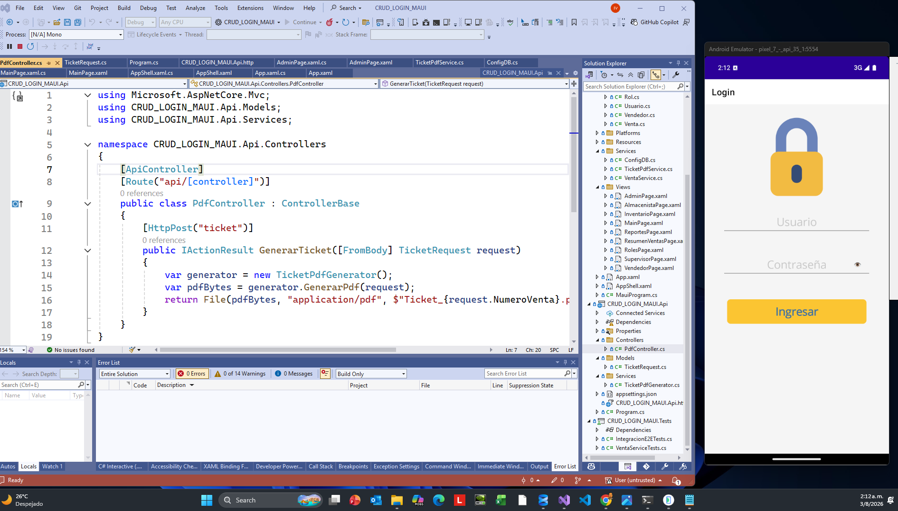
</p>


¡Bienvenido al **Manual Definitivo** de Desarrollo de Software Empresarial! 

Si estás leyendo esto, estás a punto de dar un salto cuántico en tus habilidades como programador. Este documento no es un simple tutorial ni una colección de códigos; es una **obra maestra pedagógica, arquitectónica y técnica**, diseñada meticulosamente para llevarte de cero a cien en la construcción de un sistema de nivel comercial, robusto, escalable y mantenible.

Nuestro objetivo en esta clase magistral es construir desde los cimientos un **Sistema Mini ERP y Punto de Venta (POS)** completo. Este sistema no es de juguete; cuenta con un control de acceso avanzado por roles (Administrador, Supervisor, Almacenista, Vendedor), módulos interactivos, dashboards de KPIs, y generación física de reportes (Tickets PDF térmicos). 

Todo esto lo lograremos combinando la versatilidad multiplataforma de **.NET MAUI 9** (una sola base de código para móviles y escritorio), la potencia inquebrantable de **SQL Server** para la persistencia de datos, y la escalabilidad de una **API REST en ASP.NET Core** encargada de absorber el impacto de las cargas de trabajo más pesadas.

---

### 🧠 ¿Qué es el Patrón MVVM y por qué lo usamos?
A lo largo de este proyecto, aplicaremos de manera guiada el **Patrón Arquitectónico MVVM (Model-View-ViewModel)**. 
Si alguna vez has visto aplicaciones que se "congelan" al hacer clic en un botón, es porque programaron todo en un solo lugar (código espagueti). El patrón MVVM soluciona esto dividiendo responsabilidades:
*   **Model (El Modelo):** Son las reglas de negocio y los datos crudos (Ej. La clase `Producto.cs`).
*   **View (La Vista):** Es la cara bonita, la pantalla que el usuario ve (`.xaml`). ¡No sabe hacer cálculos, solo dibuja!
*   **ViewModel (El Intermediario):** Es el cerebro oculto (`.xaml.cs` y los `Services`). Recibe el clic del botón de la **Vista**, procesa la matemática usando el **Modelo**, y le avisa a la pantalla qué cambiar sin congelarla.

Esta separación te convertirá en un ingeniero de software de alto nivel, permitiéndote escalar este proyecto ERP a cientos de pantallas sin que colapse.

<br>

### 📌 Menú de Navegación de la Clase Magistral
Para evitar que te pierdas en este extenso documento, he anclado hipervínculos a cada módulo crítico. Haz clic en el tema que deseas estudiar:

*   [1️⃣ Introducción, Herramientas y Configuración de SQL Server](#-introducción-al-modelo-y-entorno)
*   [2️⃣ El Corazón de los Datos: La Base de Datos Relacional](#-el-corazón-de-los-datos-la-base-de-datos)
*   [3️⃣ El Backend: Construyendo una API REST para Microservicios](#-el-backend-api-rest-para-microservicios)
*   [4️⃣ El Frontend (.NET MAUI): Módulo de Enrutamiento y Conexiones a BD](#-la-aplicación-cliente-net-maui)
*   [5️⃣ Las Vistas (XAML) y la Lógica Code-Behind (MVVM Guiado)](#-módulo-3-vistas--interfaces-de-usuario-carpeta-views)

<br><br>

---
---


## 📂 ESTRUCTURA DEL PROYECTO

Nuestra solución utiliza una arquitectura limpia separada en capas (MVC/MVVM guiado), compuesta por los siguientes proyectos:

1. **CRUD_LOGIN_MAUI**: La aplicación cliente multiplataforma.
2. **CRUD_LOGIN_MAUI.Api**: El backend (API REST) encargado de servicios pesados como la generación de PDFs.
3. **CRUD_LOGIN_MAUI.Tests**: Pruebas unitarias e integrales para garantizar la estabilidad.

---

## 📦 Árbol de la solución

<pre><code>
CRUD_LOGIN_MAUI/
│
├── CRUD_LOGIN_MAUI.Api/               &lt;-- Backend (.NET Core Web API)
│   ├── Program.cs
│   ├── appsettings.json
│   ├── CRUD_LOGIN_MAUI.Api.http
│   ├── Controllers/
│   │   └── PdfController.cs
│   ├── Models/
│   │   └── TicketRequest.cs
│   └── Services/
│       └── TicketPdfGenerator.cs
│
├── CRUD_LOGIN_MAUI/                   &lt;-- Frontend (.NET MAUI)
│   ├── App.xaml / App.xaml.cs
│   ├── AppShell.xaml / AppShell.xaml.cs
│   ├── MauiProgram.cs
│   ├── Models/                        &lt;-- Entidades de Datos
│   │   ├── Categoria.cs
│   │   ├── Cliente.cs
│   │   ├── DetalleVenta.cs
│   │   ├── Producto.cs
│   │   ├── ResumenVenta.cs
│   │   ├── Rol.cs
│   │   ├── Usuario.cs
│   │   ├── Vendedor.cs
│   │   └── Venta.cs
│   ├── Services/                      &lt;-- Lógica de Negocio y Conexiones
│   │   ├── ConfigDB.cs                &lt;-- Centralización de la Cadena de Conexión
│   │   ├── VentaService.cs
│   │   └── TicketPdfService.cs
│   └── Views/                         &lt;-- Interfaces de Usuario (XAML + CS)
│       ├── MainPage.xaml / MainPage.xaml.cs          &lt;-- Login
│       ├── AdminPage.xaml / AdminPage.xaml.cs        &lt;-- Panel de Administrador
│       ├── AlmacenistaPage.xaml / AlmacenistaPage.xaml.cs  &lt;-- Dashboard de Almacén
│       ├── InventarioPage.xaml / InventarioPage.xaml.cs    &lt;-- CRUD de Productos
│       ├── ReportesPage.xaml / ReportesPage.xaml.cs        &lt;-- Reportes Generales
│       ├── ResumenVentasPage.xaml / ResumenVentasPage.xaml.cs &lt;-- Resumen de Ventas
│       ├── RolesPage.xaml / RolesPage.xaml.cs              &lt;-- Gestión de Roles
│       ├── SupervisorPage.xaml / SupervisorPage.xaml.cs    &lt;-- Panel de Supervisor
│       └── VendedorPage.xaml / VendedorPage.xaml.cs        &lt;-- Panel de Vendedor
│
└── CRUD_LOGIN_MAUI.Tests/             &lt;-- Pruebas (xUnit)
    ├── IntegracionE2ETests.cs         &lt;-- Pruebas de Integración End-to-End
    └── VentaServiceTests.cs           &lt;-- Pruebas Unitarias del Servicio de Ventas
</code></pre>

---
---

> [!IMPORTANT]
> **Corrección de Modelos y Referencias XAML (0 Errores de Compilación):**
> Se corrigieron una serie de errores de compilación (`CS0050`, `CS0051`, `CS0117`, `XC0000`) estableciendo todos los modelos de la carpeta `Models` como `public class` y agregando explícitamente cada una de sus propiedades correspondientes según la base de datos SQL (ej. `Nombre`, `CategoriaId`, `PorcentajeMargen` como `string`, etc.). Además, se corrigió el archivo `AppShell.xaml` indicando correctamente el namespace de las vistas (`xmlns:views="clr-namespace:CRUD_LOGIN_MAUI.Views"`).

> [!TIP]
> **Corrección de Librerías PDF:**
> - El paquete **`itext7`** está descontinuado (deprecated) y fue removido del proyecto MAUI. Se utiliza únicamente **`itext`** (versión actual) para la generación de reportes locales en el dispositivo (Módulo Inventario / Almacén).
> - El paquete **`QuestPDF`** es de uso **exclusivo para la API** (Backend) donde se generan los tickets de venta, por lo que fue removido del proyecto MAUI para evitar conflictos y advertencias innecesarias de librerías nativas (`libQuestPdfSkia.so`).

## ⚙️ INTRODUCCIÓN AL MODELO Y ENTORNO

### 📸 Galería del Sistema

| Col 1 | Col 2 | Col 3 | Col 4 |
| --- | --- | --- | --- |
| 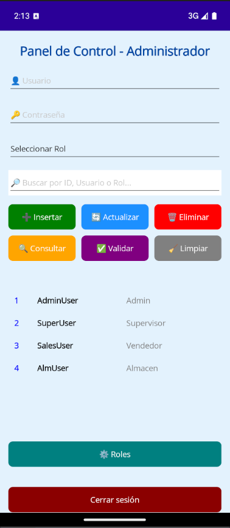 | 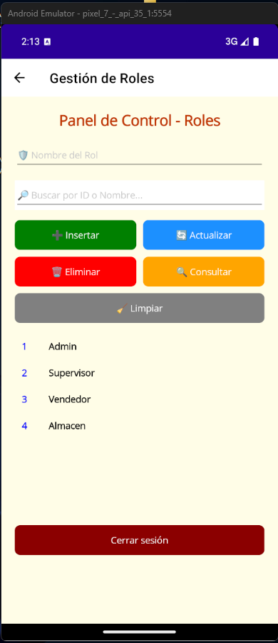 | 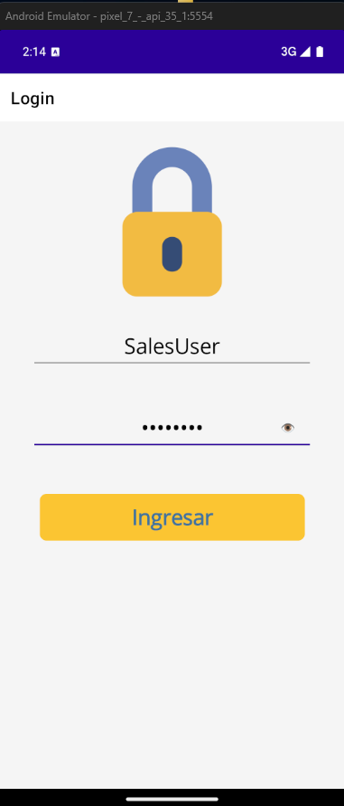 | 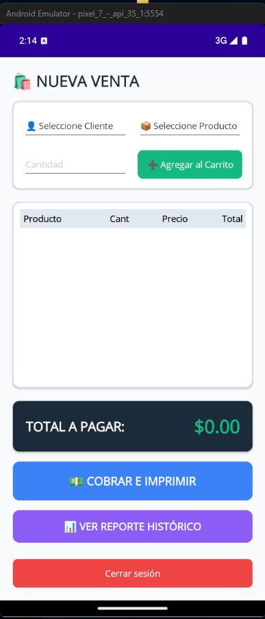 |
| 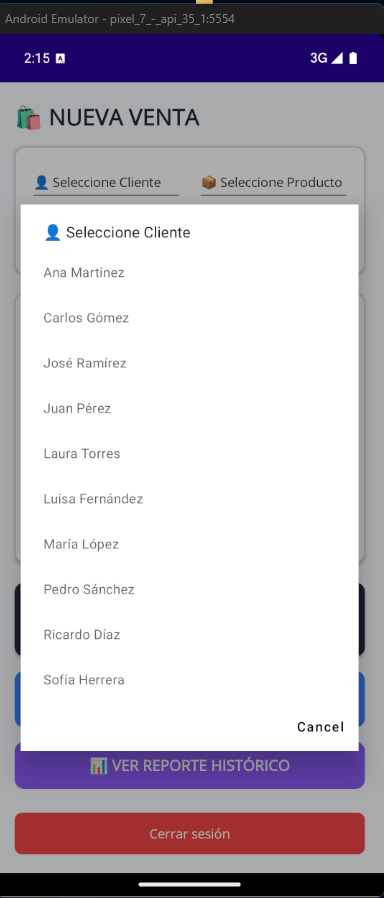 | 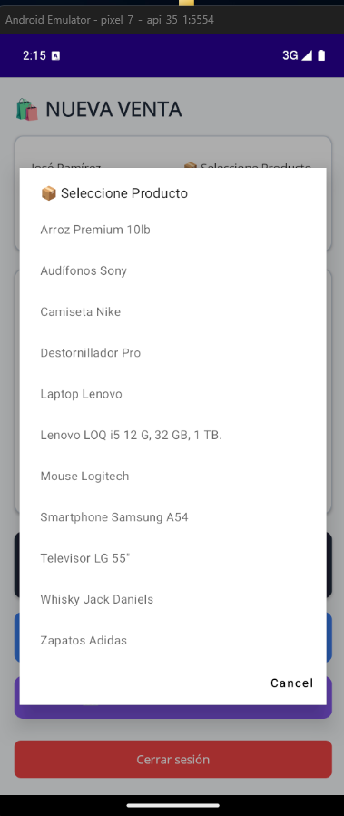 | 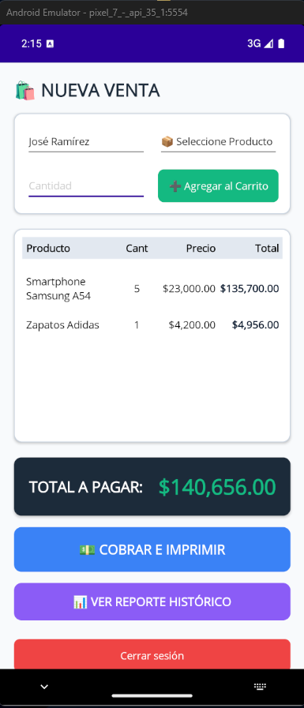 | 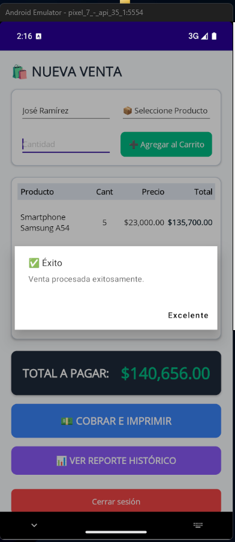 |
| 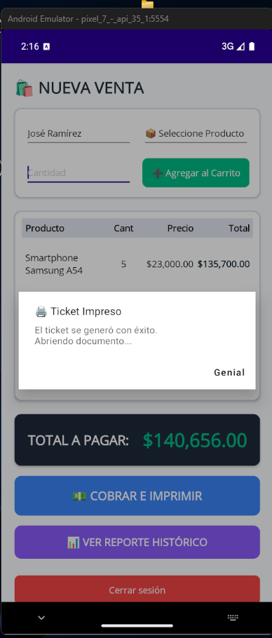 | 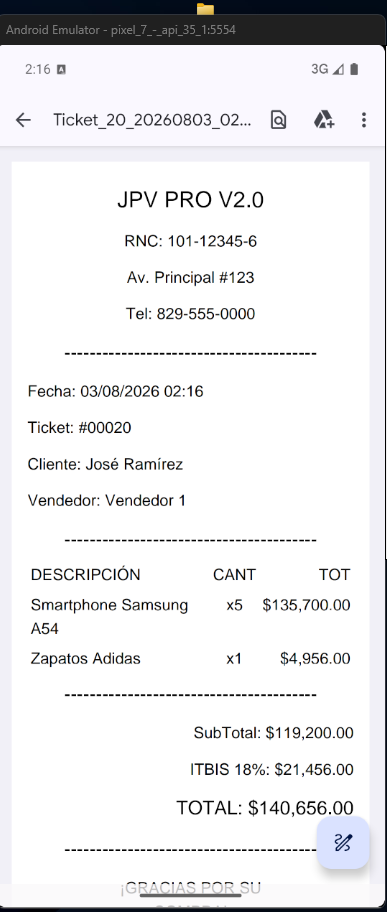 | 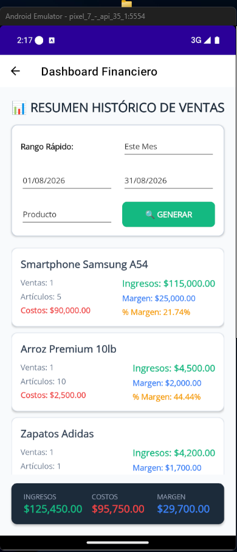 | 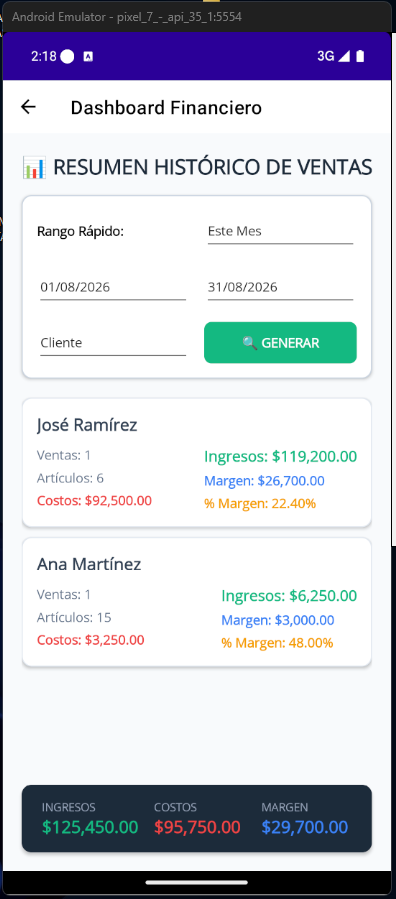 |
| 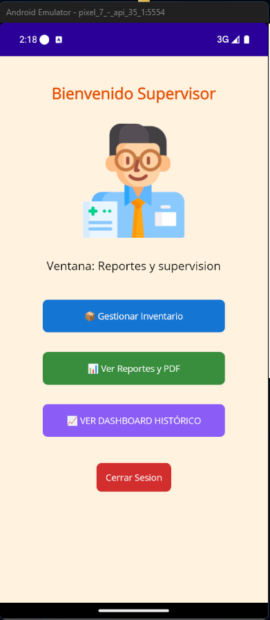 | 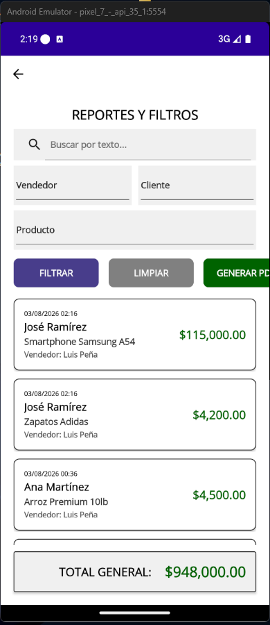 | 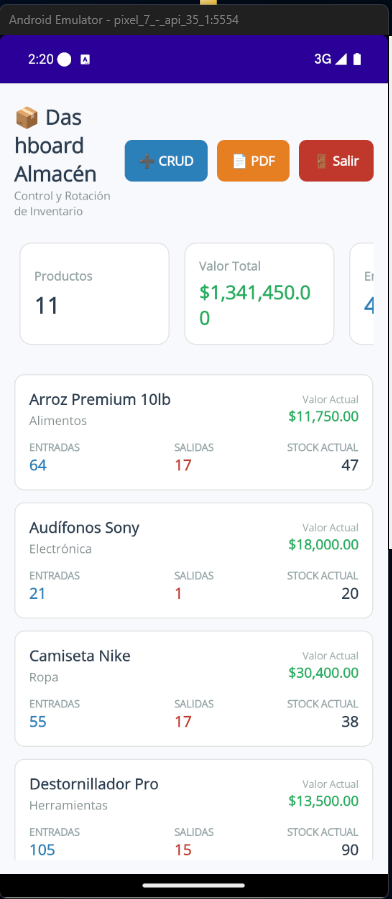 | 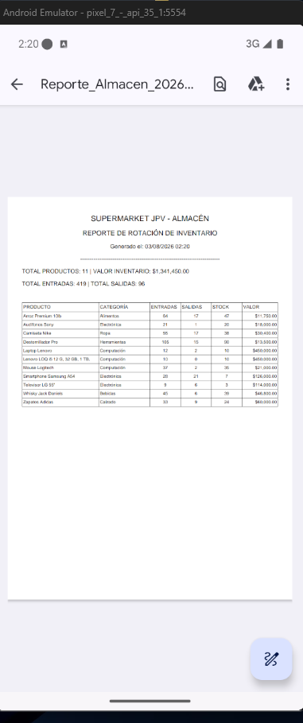 |


---
---

En el desarrollo de software moderno, construir aplicaciones robustas requiere separar correctamente las responsabilidades. Un teléfono móvil no debería encargarse de tareas intensivas de procesamiento como generar un archivo PDF pesado. Esas tareas deben ser delegadas a un servidor (API).

### 🏗️ ¿Qué tipo de proyecto es este?
Implementamos una **Arquitectura Limpia en Tres Capas**:
1. **CRUD_LOGIN_MAUI (Frontend):** La aplicación cliente multiplataforma. Con un solo código base, compilamos para Windows, Android e iOS.
2. **CRUD_LOGIN_MAUI.Api (Backend):** Una API RESTful que actúa como nuestro "cerebro pesado". 
3. **CRUD_LOGIN_MAUI.Tests (Testing):** Pruebas unitarias e integrales para garantizar la estabilidad del código en producción.

### 🛠️ Herramientas y Librerías Requeridas
*   **Motor de Base de Datos:** SQL Server.
*   **Framework:** .NET 9.0 con C#.
*   **IDE Recomendado:** Visual Studio 2022.
*   **Paquetes NuGet (MAUI):** `Microsoft.Data.SqlClient`, `itext`.
*   **Paquetes NuGet (API):** `QuestPDF`.

<br>

---
♦️♦️♦️ **SECCIÓN CRÍTICA: CONFIGURACIÓN DE RED Y USUARIO EN SQL SERVER** ♦️♦️♦️
---

**⚠️ Aclaración Importante:** Aunque en arquitecturas modernas y escalables la aplicación móvil *NUNCA* debe conectarse directamente a la Base de Datos (para eso se usa una API REST completa), en esta etapa del proyecto nuestra app MAUI sí se conectará directamente a SQL Server vía red local (`10.0.0.15`) mediante `Microsoft.Data.SqlClient`, mientras que la API solo manejará la carga de los PDFs. 

Para que los celulares o PCs remotas puedan entrar a tu SQL Server local, **DEBES** seguir estos pasos religiosamente:

#### 1. Habilitar Conexiones Remotas y TCP/IP
1. Abre **SQL Server Configuration Manager** en Windows.
2. Expande **Configuración de red de SQL Server** y haz clic en **Protocolos de SQLEXPRESS** (o tu instancia).
3. Haz doble clic en **TCP/IP** y en la pestaña *Protocolo* cambia "Habilitado" a **Sí**.
4. En la pestaña *Direcciones IP*, baja hasta el final donde dice **IPAll** (Todas las IP).
5. Borra cualquier valor en "Puertos dinámicos TCP" y en **Puerto TCP** escribe exactamente `1433`.
6. Presiona OK, ve a *Servicios de SQL Server* y **Reinicia** el servicio principal de SQL Server para aplicar cambios.

#### 2. Crear el Usuario de Conexión (Login) y Permisos
1. Abre **SQL Server Management Studio (SSMS)** y conéctate como administrador (Windows Authentication).
2. Haz clic derecho sobre la raíz del servidor y selecciona **Propiedades** > **Seguridad**.
3. Asegúrate de marcar **"Modo de autenticación de SQL Server y de Windows"**. Presiona OK (y reinicia el servicio si te lo pide).
4. En el Explorador de Objetos, ve a **Seguridad > Inicios de sesión (Logins)**.
5. Clic derecho > **Nuevo inicio de sesión...**
6. Selecciona **Autenticación de SQL Server**.
7. **Nombre de inicio de sesión:** Ponle el nombre que usarás en la cadena de conexión (ej. `JUANCITO`).
8. **Contraseña:** Pon tu clave (ej. `123456`). **Desmarca** la opción "Exigir directivas de contraseña".
9. Ve a la pestaña **Asignación de usuarios (User Mapping)**, marca la base de datos `LoginRolesDB_cif` y en la parte inferior márcale el rol `db_owner`.
10. Presiona OK. ¡Listo! Ya tienes tu SQL Server abierto al mundo local.

<br><br>

---
---

## 🗄️ EL CORAZÓN DE LOS DATOS: LA BASE DE DATOS

Todo gran sistema nace de una estructura de datos sólida. Nuestra base de datos, `LoginRolesDB_cif`, está diseñada con integridad referencial y seguridad de alto nivel. Utilizamos la función criptográfica `HASHBYTES('SHA2_256', ...)` nativa de SQL Server.

### 📄 Paso 1: Ejecutar el Script Maestro
**¿Qué hace este script?** Crea la base de datos completa, las tablas (Usuarios, Roles, Productos, Ventas), las llaves foráneas y vistas clave.
**Pasos para crearlo:**
1. Abre **SQL Server Management Studio (SSMS)**.
2. Conéctate a tu servidor local `(localdb)\MSSQLLocalDB` o `10.0.0.15`.
3. Haz clic en **"Nueva Consulta"** (New Query).
4. Copia y pega el código exacto de abajo y presiona **Ejecutar (F5)**.

```sql
/********************************************************************************************
    PROYECTO EDUCATIVO: SISTEMA DE LOGIN CON ROLES Y CONTRASEÑAS ENCRIPTADAS (SHA2_256)
    -----------------------------------------------------------------------------------
    OBJETIVO:
    Crear la base "LoginRolesDB_cif" que implementa autenticación básica con roles 
    (Admin, Supervisor, Vendedor) y contraseñas encriptadas (SHA2_256).
********************************************************************************************/

-- 1. CREAR BASE DE DATOS PRINCIPAL
CREATE DATABASE LoginRolesDB_cif_MINI_ERP;
GO

-- SELECCIONAR LA BASE DE DATOS PARA TRABAJAR
USE LoginRolesDB_cif_MINI_ERP;
GO

-- CREAR TABLA DE ROLES
-- Esta tabla define los tipos de roles disponibles en el sistema.
-- Cada rol tiene un identificador único (Id) y un nombre descriptivo (NombreRol).
CREATE TABLE Roles (
    Id INT PRIMARY KEY IDENTITY(1,1),
    NombreRol VARCHAR(50) NOT NULL
);

-- CREAR TABLA DE USUARIOS
-- Esta tabla almacena los datos de los usuarios del sistema.
-- La columna Password guarda el hash SHA2_256 de la contraseña, no el texto original.
-- IdRol establece la relación con la tabla Roles mediante clave foránea.
CREATE TABLE Usuarios (
    Id INT PRIMARY KEY IDENTITY(1,1),
    Usuario VARCHAR(50) NOT NULL,
    Password VARCHAR(64) NOT NULL, -- HASH SHA2_256
    IdRol INT FOREIGN KEY REFERENCES Roles(Id)
);

-- INSERTAR ROLES PREDEFINIDOS
-- Se agregan tres roles básicos para el sistema: Admin, Supervisor y Vendedor.
INSERT INTO Roles (NombreRol) VALUES ('Admin'), ('Supervisor'), ('Vendedor'), ('Almacenista');

select * from roles

-- INSERTAR USUARIOS CON CONTRASEÑAS ENCRIPTADAS
-- Se usa la función HASHBYTES con el algoritmo SHA2_256 para generar el hash.
-- CONVERT(VARCHAR(64), ..., 2) transforma el resultado binario en texto hexadecimal.
INSERT INTO Usuarios (Usuario, Password, IdRol) VALUES
('AdminUser', CONVERT(VARCHAR(64), HASHBYTES('SHA2_256', 'admin123'), 2), 1),
('SuperUser', CONVERT(VARCHAR(64), HASHBYTES('SHA2_256', 'super123'), 2), 2),
('SalesUser', CONVERT(VARCHAR(64), HASHBYTES('SHA2_256', 'sales123'), 2), 3),
('AlmUser', CONVERT(VARCHAR(64), HASHBYTES('SHA2_256', '123456'), 2), 4);
GO

-- CONSULTAR TODOS LOS USUARIOS REGISTRADOS
-- Muestra los datos almacenados en la tabla Usuarios.
SELECT * FROM Usuarios;

-- CONSULTAR TODOS LOS ROLES DISPONIBLES
-- Permite verificar los roles creados en la tabla Roles.
SELECT * FROM Roles;

-- CONSULTAR USUARIOS JUNTO A SUS ROLES
-- Realiza un INNER JOIN entre Usuarios y Roles para mostrar el nombre del rol asignado.
SELECT u.Usuario, u.Password, r.NombreRol
FROM Usuarios u
INNER JOIN Roles r ON u.IdRol = r.Id;
GO

-- VALIDAR LOGIN DE UN USUARIO (EJEMPLO: ADMINUSER)
-- Se declaran variables para simular el ingreso de credenciales.
DECLARE @Usuario VARCHAR(50) = 'AdminUser';
DECLARE @Password VARCHAR(50) = 'admin123';

-- Se compara el usuario y el hash de la contraseña ingresada con los datos almacenados.
-- Si coinciden, se devuelve el nombre del usuario y su rol correspondiente.
SELECT u.Usuario, r.NombreRol
FROM Usuarios u
INNER JOIN Roles r ON u.IdRol = r.Id
WHERE u.Usuario = @Usuario
AND u.Password = CONVERT(VARCHAR(64), HASHBYTES('SHA2_256', @Password), 2);
GO


-- Ejecuta esto y mira el resultado en la columna "HashCalculado"
SELECT 
    Usuario, 
    Password AS PasswordGuardado,
    CONVERT(VARCHAR(64), HASHBYTES('SHA2_256', 'admin123'), 2) AS HashCalculado
FROM Usuarios 
WHERE Usuario = 'AdminUser';


-- 1. CATEGORIA
CREATE TABLE Categoria (
    Id      INT          IDENTITY(1,1) PRIMARY KEY,
    Nombre  VARCHAR(100) NOT NULL
);

-- 2. PRODUCTO
CREATE TABLE Producto (
    Id           INT           IDENTITY(1,1) PRIMARY KEY,
    Nombre       VARCHAR(100)  NOT NULL,
    CategoriaId  INT           NOT NULL,
    PrecioCompra DECIMAL(10,2) NOT NULL,
    PrecioVenta  DECIMAL(10,2) NOT NULL,
    Stock        INT           NOT NULL,
    CONSTRAINT FK_Producto_Categoria FOREIGN KEY (CategoriaId) REFERENCES Categoria(Id)
);

-- 3. CLIENTE
CREATE TABLE Cliente (
    Id       INT          IDENTITY(1,1) PRIMARY KEY,
    Nombre   VARCHAR(100) NOT NULL,
    RNC      VARCHAR(20),
    Telefono VARCHAR(20)
);

-- 4. VENDEDOR
CREATE TABLE Vendedor (
    Id     INT          IDENTITY(1,1) PRIMARY KEY,
    Nombre VARCHAR(100) NOT NULL,
    Codigo VARCHAR(20)  NOT NULL UNIQUE
);

-- 5. VENTAS (Cabecera de la factura)
CREATE TABLE Ventas (
    Id         INT      IDENTITY(1,1) PRIMARY KEY,
    Fecha      DATETIME NOT NULL DEFAULT GETDATE(),
    ClienteId  INT      NOT NULL,
    VendedorId INT      NOT NULL,
    CONSTRAINT FK_Ventas_Cliente  FOREIGN KEY (ClienteId)  REFERENCES Cliente(Id),
    CONSTRAINT FK_Ventas_Vendedor FOREIGN KEY (VendedorId) REFERENCES Vendedor(Id)
);

-- 6. DETALLE_VENTAS (Líneas de los productos con Columnas Calculadas)
CREATE TABLE Detalle_Ventas (
    Id                  INT           IDENTITY(1,1) PRIMARY KEY,
    VentaId             INT           NOT NULL,
    ProductoId          INT           NOT NULL,
    Cantidad            INT           NOT NULL,
    PrecioVentaAplicado DECIMAL(10,2) NOT NULL,

    -- Cálculos automáticos guardados físicamente
    SubTotal AS (Cantidad * PrecioVentaAplicado)               PERSISTED,
    Itbis    AS ((Cantidad * PrecioVentaAplicado) * 0.18)      PERSISTED,
    Total    AS ((Cantidad * PrecioVentaAplicado) * 1.18)      PERSISTED,

    CONSTRAINT FK_DetalleVentas_Ventas   FOREIGN KEY (VentaId)    REFERENCES Ventas(Id),
    CONSTRAINT FK_DetalleVentas_Producto FOREIGN KEY (ProductoId) REFERENCES Producto(Id)
);
GO


/* ============================================================
   1. CATEGORIA (10 registros)
   ============================================================ */
INSERT INTO Categoria (Nombre) VALUES
('Electrónica'), ('Hogar'), ('Computación'), ('Ropa'), ('Calzado'),
('Juguetes'), ('Bebidas'), ('Alimentos'), ('Accesorios'), ('Herramientas');

/* ============================================================
   2. PRODUCTO (10 registros)
   ============================================================ */
INSERT INTO Producto (Nombre, CategoriaId, PrecioCompra, PrecioVenta, Stock) VALUES
('Laptop Lenovo', 3, 45000, 52000, 10),
('Smartphone Samsung A54', 1, 18000, 23000, 25),
('Televisor LG 55"', 1, 38000, 45000, 8),
('Camiseta Nike', 4, 800, 1500, 50),
('Zapatos Adidas', 5, 2500, 4200, 30),
('Destornillador Pro', 10, 150, 350, 100),
('Whisky Jack Daniels', 7, 1200, 1800, 40),
('Arroz Premium 10lb', 8, 250, 450, 60),
('Mouse Logitech', 3, 600, 1200, 35),
('Audífonos Sony', 1, 900, 1600, 20);

/* ============================================================
   3. CLIENTE (10 registros)
   ============================================================ */
INSERT INTO Cliente (Nombre, RNC, Telefono) VALUES
('Juan Pérez', '001234567', '809-555-1001'),
('María López', '002345678', '809-555-1002'),
('Carlos Gómez', '003456789', '809-555-1003'),
('Ana Martínez', '004567890', '809-555-1004'),
('Pedro Sánchez', '005678901', '809-555-1005'),
('Laura Torres', '006789012', '809-555-1006'),
('José Ramírez', '007890123', '809-555-1007'),
('Luisa Fernández', '008901234', '809-555-1008'),
('Ricardo Díaz', '009012345', '809-555-1009'),
('Sofía Herrera', '010123456', '809-555-1010');

/* ============================================================
   4. VENDEDOR (10 registros)
   ============================================================ */
INSERT INTO Vendedor (Nombre, Codigo) VALUES
('Luis Peña', 'VEN001'), ('Carlos Ruiz', 'VEN002'),
('Marcos Castillo', 'VEN003'), ('Daniela Ortiz', 'VEN004'),
('Fernanda Cruz', 'VEN005'), ('Miguel Santos', 'VEN006'),
('Rosa Jiménez', 'VEN007'), ('Javier Molina', 'VEN008'),
('Patricia Núñez', 'VEN009'), ('Samuel Batista', 'VEN010');

/* ============================================================
   5. VENTAS (10 Facturas)
   ============================================================ */
INSERT INTO Ventas (ClienteId, VendedorId) VALUES
(1, 1), (2, 2), (3, 3), (4, 4), (5, 5), 
(6, 6), (7, 7), (8, 8), (9, 9), (10, 10);

/* ============================================================
   6. DETALLE_VENTAS (15 líneas de productos distribuidas)
   ============================================================ */
INSERT INTO Detalle_Ventas (VentaId, ProductoId, Cantidad, PrecioVentaAplicado) VALUES
(1, 1, 1, 52000), -- Factura 1
(1, 2, 1, 23000), -- Factura 1 (2do producto)
(2, 2, 2, 23000), -- Factura 2
(3, 3, 1, 45000), -- Factura 3
(3, 4, 2, 1500),  -- Factura 3 (2do producto)
(4, 4, 3, 1500),  -- Factura 4
(5, 5, 1, 4200),  -- Factura 5
(5, 7, 3, 1800),  -- Factura 5 (2do producto)
(6, 6, 5, 350),   -- Factura 6
(7, 7, 2, 1800),  -- Factura 7
(7, 1, 1, 52000), -- Factura 7 (2do producto)
(8, 8, 4, 450),   -- Factura 8
(9, 9, 2, 1200),  -- Factura 9
(9, 5, 2, 4200),  -- Factura 9 (2do producto)
(10, 10, 1, 1600);-- Factura 10
GO

/* ============================================================
   CONSULTAS Y JOINS PARA EL NUEVO MODELO
   ============================================================ */

-- JOIN COMPLETO PARA VER CABECERA Y DETALLE (IDs + Nombres)

SELECT 
    v.Id AS NumeroFactura,
    v.Fecha,
    c.Nombre AS Cliente,
    ven.Nombre AS Vendedor,
    p.Nombre AS Producto,
    dv.Cantidad,
    dv.PrecioVentaAplicado AS PrecioUnidad,
    dv.SubTotal,
    dv.Itbis,
    dv.Total AS TotalLinea
FROM Ventas v
INNER JOIN Detalle_Ventas dv ON v.Id = dv.VentaId
INNER JOIN Cliente c         ON v.ClienteId = c.Id
INNER JOIN Vendedor ven      ON v.VendedorId = ven.Id
INNER JOIN Producto p        ON dv.ProductoId = p.Id
ORDER BY v.Id ASC;

-- JOIN PARA VER EL TOTAL CONSOLIDADO POR FACTURA

SELECT 
    v.Id AS NumeroFactura,
    v.Fecha,
    c.Nombre AS Cliente,
    ven.Nombre AS Vendedor,
    SUM(dv.Cantidad) AS TotalArticulos,
    SUM(dv.SubTotal) AS SubTotalFactura,
    SUM(dv.Itbis) AS ItbisFactura,
    SUM(dv.Total) AS TotalPagarFactura
FROM Ventas v
INNER JOIN Detalle_Ventas dv ON v.Id = dv.VentaId
INNER JOIN Cliente c         ON v.ClienteId = c.Id
INNER JOIN Vendedor ven      ON v.VendedorId = ven.Id
GROUP BY v.Id, v.Fecha, c.Nombre, ven.Nombre
ORDER BY v.Id ASC;


--CREA VISTA MOVIMIENTO DE ALMACEN:

CREATE VIEW vw_ReporteInventario AS
SELECT 
    p.Id AS ProductoId,
    p.Nombre AS Producto,
    c.Nombre AS Categoria,
    p.PrecioCompra,
    p.PrecioVenta,
    p.Stock AS StockActual,
    ISNULL((SELECT SUM(Cantidad) FROM Detalle_Ventas WHERE ProductoId = p.Id), 0) AS TotalSalidas,
    p.Stock + ISNULL((SELECT SUM(Cantidad) FROM Detalle_Ventas WHERE ProductoId = p.Id), 0) AS StockInicialEntradas,
    (p.Stock * p.PrecioCompra) AS ValorInventario
FROM Producto p
LEFT JOIN Categoria c ON p.CategoriaId = c.Id;


-- ejeutar la vista"

select * from vw_ReporteInventario

```

<br><br>

---
---

## 🧠 EL BACKEND: API REST PARA MICROSERVICIOS

### ¿Por qué creamos este proyecto?
Delegar carga pesada. En lugar de que la App MAUI queme recursos dibujando un PDF térmico, le enviamos un JSON (payload) a esta API usando el verbo HTTP `POST`. La API procesa el archivo con `QuestPDF` a velocidad relámpago y nos devuelve los bytes.
*Nota: Posteriormente agregaremos Procedimientos Almacenados (SPs) y expandiremos esta API para todo el CRUD.*

**Pasos para crear el proyecto API:**
1. Abre Visual Studio 2022 y dale a **"Crear un proyecto nuevo"**.
2. Busca y selecciona **"API web de ASP.NET Core"**.
3. Nómbralo `CRUD_LOGIN_MAUI.Api` y selecciona **.NET 9.0**.

---

### 📁 Archivo: `Program.cs` (Arranque de la API)
**¿De qué se trata?** Es el punto de entrada (Entry Point) del microservicio. Configura la inyección de dependencias y mapea los controladores.
**Pasos para crearlo:** En la raíz del proyecto API, este archivo ya existe por defecto. Solo debes borrar todo su contenido, copiar y pegar este código:

```csharp
var builder = WebApplication.CreateBuilder(args);
builder.Services.AddControllers();
var app = builder.Build();
app.MapControllers();
app.Run();

```

---

### 📁 Carpeta y Archivo: `Models/TicketRequest.cs` (Contrato de Datos)
**¿De qué se trata?** Es una clase plana (DTO) que define exactamente los datos que esperamos recibir desde MAUI (cliente, productos, totales) para armar el PDF.
**Pasos para crearlo:**
1. Clic derecho en el proyecto API > **Agregar** > **Nueva Carpeta**, llámala `Models`.
2. Clic derecho en `Models` > **Agregar** > **Clase**. Nómbrala `TicketRequest.cs`.

```csharp
using System.Collections.Generic;

namespace CRUD_LOGIN_MAUI.Api.Models
{
    public class TicketRequest
    {
        public int NumeroVenta { get; set; }
        public string ClienteNombre { get; set; } = string.Empty;
        public string VendedorNombre { get; set; } = string.Empty;
        public decimal TotalGeneral { get; set; }
        public List<DetalleTicketRequest> Detalles { get; set; } = new();
    }

    public class DetalleTicketRequest
    {
        public string ProductoNombre { get; set; } = string.Empty;
        public int Cantidad { get; set; }
        public decimal PrecioVentaAplicado { get; set; }
        public decimal Total { get; set; }
    }
}

```

---

### 📁 Carpeta y Archivo: `Services/TicketPdfGenerator.cs` (Dibujante PDF)
**¿De qué se trata?** Aquí vive la lógica de `QuestPDF`. Se encarga de dibujar milimétricamente el ticket térmico de 80mm.
**Pasos para crearlo:**
1. Clic derecho en el proyecto API > **Agregar** > **Nueva Carpeta**, llámala `Services`.
2. Clic derecho en `Services` > **Agregar** > **Clase**, nómbrala `TicketPdfGenerator.cs`.
3. Instala el paquete NuGet: `QuestPDF`.

```csharp
using System;
using QuestPDF.Fluent;
using QuestPDF.Helpers;
using QuestPDF.Infrastructure;
using CRUD_LOGIN_MAUI.Api.Models;

namespace CRUD_LOGIN_MAUI.Api.Services
{
    public class TicketPdfGenerator
    {
        public byte[] GenerarPdf(TicketRequest request)
        {
            QuestPDF.Settings.License = LicenseType.Community;

            var document = QuestPDF.Fluent.Document.Create(container =>
            {
                container.Page(page =>
                {
                    page.ContinuousSize(80, Unit.Millimetre);
                    page.Margin(5, Unit.Millimetre);
                    page.PageColor(Colors.White);
                    page.DefaultTextStyle(x => x.FontSize(10).FontFamily(Fonts.Arial));

                    page.Header().Element(ComposeHeader);
                    page.Content().Element(x => ComposeContent(x, request));
                    page.Footer().AlignCenter().Text("¡Gracias por su compra!").SemiBold();
                });
            });

            return document.GeneratePdf();
        }

        private void ComposeHeader(QuestPDF.Infrastructure.IContainer container)
        {
            container.Column(column =>
            {
                column.Item().AlignCenter().Text("SUPERMERCADO JPV").FontSize(14).SemiBold();
                column.Item().AlignCenter().Text("RNC: 101-23456-7");
                column.Item().AlignCenter().Text("Av. Principal #123, SD");
                column.Item().PaddingVertical(5).LineHorizontal(1).LineColor(Colors.Black);
            });
        }

        private void ComposeContent(QuestPDF.Infrastructure.IContainer container, TicketRequest request)
        {
            container.Column(column =>
            {
                column.Item().Text($"Ticket #: {request.NumeroVenta}");
                column.Item().Text($"Fecha: {DateTime.Now:dd/MM/yyyy HH:mm}");
                column.Item().Text($"Cliente: {request.ClienteNombre}");
                column.Item().Text($"Cajero: {request.VendedorNombre}");
                column.Item().PaddingVertical(5).LineHorizontal(1).LineColor(Colors.Black);

                column.Item().Row(row =>
                {
                    row.RelativeItem(3).Text("Desc").SemiBold();
                    row.RelativeItem(1).AlignRight().Text("Cant").SemiBold();
                    row.RelativeItem(2).AlignRight().Text("Prec").SemiBold();
                    row.RelativeItem(2).AlignRight().Text("Total").SemiBold();
                });

                foreach (var item in request.Detalles)
                {
                    column.Item().Row(row =>
                    {
                        row.RelativeItem(3).Text(item.ProductoNombre);
                        row.RelativeItem(1).AlignRight().Text(item.Cantidad.ToString());
                        row.RelativeItem(2).AlignRight().Text(item.PrecioVentaAplicado.ToString("C"));
                        row.RelativeItem(2).AlignRight().Text(item.Total.ToString("C"));
                    });
                }

                column.Item().PaddingVertical(5).LineHorizontal(1).LineColor(Colors.Black);
                column.Item().AlignRight().Text($"TOTAL: {request.TotalGeneral:C}").FontSize(12).SemiBold();
            });
        }
    }
}

```

> [!NOTE]
> **Resolución de Referencias Ambiguas:**
> Hemos especificado explícitamente `QuestPDF.Fluent.Document` y `QuestPDF.Infrastructure.IContainer` en este código para prevenir errores comunes de ambigüedad (`'Document' is an ambiguous reference` y `'IContainer' is an ambiguous reference`). Estos errores ocurren si tu proyecto incluye referencias adicionales como `System.ComponentModel` o `System.Reflection.Metadata`, las cuales contienen interfaces o clases con el mismo nombre.
> De este modo, evitamos choques de nombres sin importar qué librerías nativas esté usando la API.

---

### 📁 Carpeta y Archivo: `Controllers/PdfController.cs` (El Endpoint)
**¿De qué se trata?** Expone una URL (`/api/pdf/ticket`) que escucha peticiones HTTP POST. Recibe el JSON y se lo pasa al generador.
**Pasos para crearlo:**
1. Clic derecho en la carpeta `Controllers` > **Agregar** > **Controlador**.
2. Selecciona **Controlador de API - en blanco**. Nómbralo `PdfController.cs`.

```csharp
using Microsoft.AspNetCore.Mvc;
using CRUD_LOGIN_MAUI.Api.Models;
using CRUD_LOGIN_MAUI.Api.Services;

namespace CRUD_LOGIN_MAUI.Api.Controllers
{
    [ApiController]
    [Route("api/[controller]")]
    public class PdfController : ControllerBase
    {
        [HttpPost("ticket")]
        public IActionResult GenerarTicket([FromBody] TicketRequest request)
        {
            var generator = new TicketPdfGenerator();
            var pdfBytes = generator.GenerarPdf(request);
            return File(pdfBytes, "application/pdf", $"Ticket_{request.NumeroVenta}.pdf");
        }
    }
}

```

<br><br>

---
---
---

## 📱 LA APLICACIÓN CLIENTE: .NET MAUI

### ¿Por qué creamos este proyecto?
Es el Frontend con el que el usuario interactúa. Su trabajo es mostrar datos visualmente atractivos y delegar las reglas pesadas de negocio a la base de datos o la API.

**Pasos para crear el proyecto MAUI:**
1. Abre Visual Studio 2022 y dale a **"Crear un proyecto nuevo"**.
2. Selecciona **"Aplicación .NET MAUI"**.
3. Nómbralo `CRUD_LOGIN_MAUI` y selecciona **.NET 9.0**.

<br><br>

---

### ⚙️ MÓDULO 1: ENRUTAMIENTO Y RUTAS BASE

#### 📄 Archivo Gráfico: `AppShell.xaml`
**¿De qué se trata?** Define el "esqueleto" visual de navegación de la app. Aquí desactivamos la barra superior (Menú lateral o Flyout) para forzar que el usuario pase obligatoriamente por el Login por temas de seguridad.
**Pasos para crearlo:** Este archivo ya viene por defecto en el proyecto MAUI. Ábrelo y reemplaza su código con lo siguiente:

```xml
<?xml version="1.0" encoding="UTF-8" ?>
<Shell
    x:Class="CRUD_LOGIN_MAUI.AppShell"
    xmlns="http://schemas.microsoft.com/dotnet/2021/maui"
    xmlns:x="http://schemas.microsoft.com/winfx/2009/xaml"
    xmlns:views="clr-namespace:CRUD_LOGIN_MAUI.Views"
    Title="Mini ERP JPV"
    FlyoutBehavior="Disabled">

    <ShellContent
        Title="Login"
        ContentTemplate="{DataTemplate views:MainPage}"
        Route="MainPage" />
</Shell>

```

<br>
<br>

---
♦️♦️♦️ **SEPARADOR: LA LÓGICA DEL ENRUTAMIENTO** ♦️♦️♦️
---

<br>
<br>

#### 🧠 Archivo Lógico: `AppShell.xaml.cs`
**¿De qué se trata?** Es el Code-Behind que registra las rutas ocultas (como la página de administrador o vendedor) para que la app sepa hacia dónde navegar de forma dinámica cuando llamamos al comando `GoToAsync`.
**Pasos para crearlo:** Despliega el archivo `AppShell.xaml` en el Explorador de Soluciones y abre `AppShell.xaml.cs`. Reemplaza el código con el siguiente:

```csharp
using Microsoft.Maui.Controls;
using CRUD_LOGIN_MAUI.Views;

namespace CRUD_LOGIN_MAUI
{
    public partial class AppShell : Shell
    {
        public AppShell()
        {
            InitializeComponent();
            
            Routing.RegisterRoute("AdminPage", typeof(AdminPage));
            Routing.RegisterRoute("SupervisorPage", typeof(SupervisorPage));
            Routing.RegisterRoute("VendedorPage", typeof(VendedorPage));
            Routing.RegisterRoute("AlmacenPage", typeof(AlmacenistaPage));
            Routing.RegisterRoute("RolesPage", typeof(RolesPage));
            Routing.RegisterRoute("InventarioPage", typeof(InventarioPage));
            Routing.RegisterRoute("ReportesPage", typeof(ReportesPage));
            Routing.RegisterRoute("ResumenVentasPage", typeof(ResumenVentasPage));
        }
    }
}

```

<br><br>

---
---

### ⚙️ MÓDULO 1.5: LOS MODELOS DE DATOS

En la arquitectura **MVVM (Model-View-ViewModel)**, los **Modelos (Models)** representan el bloque fundamental de información de nuestra aplicación. Son clases puras de C# que abstraen los datos del mundo real (como un Cliente, un Producto o una Venta) para que la aplicación pueda manipularlos, mostrarlos y enviarlos.

**¿Por qué es vital que coincidan con la base de datos SQL?**
Porque los Modelos actúan como el "espejo" directo de nuestras tablas en la base de datos. Cada propiedad en la clase C# debe mapear correctamente al tipo de dato (y en muchos casos, al nombre) de la columna en SQL Server. Si hay discrepancias, al intentar leer o escribir datos usando `SqlDataReader`, el programa colapsará (lanzando excepciones de tipo o columna no encontrada). Asegurar esta simetría garantiza un flujo de datos limpio, seguro y predecible a través de todas las capas del ERP.

A continuación, crearemos cada uno de estos Modelos dentro de la carpeta `Models/` del proyecto MAUI. Es vital que estas clases sean marcadas como `public class` para que la UI (XAML) y los Servicios puedan acceder a sus propiedades libremente.

#### `Categoria.cs`
**Uso en el ERP:** Esta clase sirve para clasificar los productos del inventario (ej. "Electrónica", "Hogar"). Permite agrupar y filtrar productos fácilmente en el sistema de ventas y en los reportes de almacén.
```csharp
namespace CRUD_LOGIN_MAUI.Models
{
    public class Categoria
    {
        public int Id { get; set; }
        public string Nombre { get; set; }
    }
}
```

#### `Cliente.cs`
**Uso en el ERP:** Representa a los compradores o entidades a quienes se les emiten las facturas. Contiene datos vitales para la facturación comprobada, como el Registro Nacional del Contribuyente (RNC) y el teléfono de contacto para el seguimiento de ventas.
```csharp
namespace CRUD_LOGIN_MAUI.Models
{
    public class Cliente
    {
        public int Id { get; set; }
        public string Nombre { get; set; }
        public string RNC { get; set; }
        public string Telefono { get; set; }
    }
}
```

#### `DetalleVenta.cs`
**Uso en el ERP:** Modela cada una de las líneas individuales de una factura (los productos que se están comprando en una transacción específica). Almacena temporalmente cálculos financieros cruciales como el Subtotal, ITBIS (impuestos) y el Total a pagar por ese renglón antes de enviarse a la API de PDF o a la base de datos.
```csharp
namespace CRUD_LOGIN_MAUI.Models
{
    public class DetalleVenta
    {
        public int ProductoId { get; set; }
        public string ProductoNombre { get; set; }
        public int Cantidad { get; set; }
        public decimal PrecioVentaAplicado { get; set; }
        public decimal Total { get; set; }
        public decimal SubTotal { get; set; }
        public decimal Itbis { get; set; }
    }
}
```

#### `Producto.cs`
**Uso en el ERP:** Es el núcleo del módulo de inventario. Guarda toda la información de la mercancía, desde su costo de adquisición y precio al público, hasta la cantidad de unidades disponibles (Stock) y a qué categoría pertenece, facilitando el control de almacén.
```csharp
namespace CRUD_LOGIN_MAUI.Models
{
    public class Producto
    {
        public int Id { get; set; }
        public string Nombre { get; set; }
        public int CategoriaId { get; set; }
        public string CategoriaNombre { get; set; }
        public decimal PrecioCompra { get; set; }
        public decimal PrecioVenta { get; set; }
        public int Stock { get; set; }
    }
}
```

#### `ResumenVenta.cs`
**Uso en el ERP:** Una clase especializada para los Dashboards y paneles gerenciales. No corresponde directamente a una tabla física en SQL, sino que se utiliza para recibir los resultados consolidados de consultas complejas (JOINs y agrupaciones), mostrando ingresos, costos y márgenes de ganancia.
```csharp
namespace CRUD_LOGIN_MAUI.Models
{
    public class ResumenVenta
    {
        public string Agrupador { get; set; }
        public int CantidadVentas { get; set; }
        public int TotalArticulos { get; set; }
        public decimal Ingresos { get; set; }
        public decimal Costos { get; set; }
        public decimal Margen { get; set; }
        public string PorcentajeMargen { get; set; }
    }
}
```

#### `Rol.cs`
**Uso en el ERP:** Define los niveles de acceso al sistema (ej. Admin, Vendedor, Supervisor). Trabaja en conjunto con la tabla de Usuarios para asegurar que cada empleado solo vea las pantallas y botones a los que tiene permiso.
```csharp
namespace CRUD_LOGIN_MAUI.Models
{
    public class Rol
    {
        public int Id { get; set; }
        public string NombreRol { get; set; }
    }
}
```

#### `Usuario.cs`
**Uso en el ERP:** Modela los datos de inicio de sesión de cada persona que utiliza el ERP. Maneja la propiedad `NombreUsuario` (clave para evitar errores de compilación) y el hash encriptado de su contraseña, vinculando al empleado con su respectivo Rol de seguridad.
```csharp
namespace CRUD_LOGIN_MAUI.Models
{
    public class Usuario
    {
        public int Id { get; set; }
        public string NombreUsuario { get; set; }
        public string Password { get; set; }
        public int IdRol { get; set; }
    }
}
```

#### `Vendedor.cs`
**Uso en el ERP:** Almacena la información de los empleados que concretan las ventas. Es fundamental para poder rastrear qué vendedor procesó cada factura, permitiendo así el cálculo de comisiones y métricas de desempeño.
```csharp
namespace CRUD_LOGIN_MAUI.Models
{
    public class Vendedor
    {
        public int Id { get; set; }
        public string Nombre { get; set; }
        public string Codigo { get; set; }
    }
}
```

#### `Venta.cs`
**Uso en el ERP:** Representa la cabecera general de una transacción comercial. Aglutina quién compró, quién vendió y en qué fecha se realizó, proporcionando una vista simplificada de la factura sin entrar en los detalles de las líneas de producto.
```csharp
using System;

namespace CRUD_LOGIN_MAUI.Models
{
    public class Venta
    {
        public int Id { get; set; }
        public DateTime Fecha { get; set; }
        public string ClienteNombre { get; set; }
        public string VendedorNombre { get; set; }
        public string ProductoNombre { get; set; }
        public int Cantidad { get; set; }
        public decimal Total { get; set; }
    }
}
```

<br><br>

---
---

### ⚙️ MÓDULO 2: CAPA DE SERVICIOS Y CONEXIONES A BD (EL MOTOR DEL SISTEMA)

En el patrón MVVM y en cualquier arquitectura limpia, las "Vistas" (las pantallas que ve el usuario) **nunca** deben hablar directamente con la base de datos. Para mantener nuestro código ordenado, seguro y altamente escalable, delegamos todo el trabajo pesado a una **Capa de Servicios**.

Esta capa actuará como el único intermediario (o "puente") entre nuestras pantallas y el servidor SQL. Aquí es donde vivirá la lógica pura de negocio: abrir conexiones de red, ejecutar comandos SQL (SELECT, INSERT, UPDATE, DELETE), procesar listas de datos y devolver la información masticada y lista para la interfaz gráfica.

**¿Cuántos archivos conforman este módulo estratégico?**
En nuestro Mini ERP, esta capa estará conformada exclusivamente por **3 archivos fundamentales** (clases C#):

1. 🔑 **`ConfigDB.cs`**: El guardián de las llaves. Su única misión es almacenar de forma centralizada la cadena de conexión (IP del servidor, usuario y contraseña) hacia nuestro SQL Server, evitando que repitamos estos datos sensibles por todo el código.
2. 🧠 **`VentaService.cs`**: El núcleo del sistema. Un archivo masivo que contendrá absolutamente todas las funciones asíncronas (`async/await`) para interactuar con las tablas de la base de datos (Gestión de Productos, Clientes, Vendedores, Procesamiento de Ventas y Reportes).
3. 🖨️ **`TicketPdfService.cs`**: El diseñador gráfico en código. Se encarga de recibir los datos de una venta recién realizada, ensamblar el recibo con formato térmico de 80mm usando la librería `iText`, y guardar el archivo PDF físicamente en el dispositivo.

---

#### 📁 Preparación de la Carpeta: `Services/`
**Pasos previos obligatorios:** 
1. En el Explorador de Soluciones de Visual Studio, haz clic derecho sobre el proyecto principal **`CRUD_LOGIN_MAUI`**.
2. Selecciona **Agregar** > **Nueva Carpeta**.
3. Nómbrala exactamente **`Services`** (respetando la 'S' mayúscula para seguir el estándar de nomenclatura).

<br>

<br>

#### 📄 Archivo Lógico: `ConfigDB.cs` (Cadena de Conexión)
**¿De qué se trata?** Centraliza la IP y credenciales del servidor SQL, evitando repetir la cadena de conexión mil veces por todo el código (cumpliendo el principio DRY de arquitectura de software).
**Pasos para crearlo:** Clic derecho en `Services` > **Agregar** > **Clase**. Nómbrala `ConfigDB.cs` y copia este código:

```csharp
namespace CRUD_LOGIN_MAUI.Services
{
    public static class ConfigDB
    {
        public static string ConnectionString =>
            "Server=192.168.2.55,1433;Database=LoginRolesDB_cif_MINI_ERP;User Id=JUANCITO;Password=123456;TrustServerCertificate=True;";
    }
}

```

<br>

---
♦️♦️♦️ **SEPARADOR: SERVICIO SIGUIENTE** ♦️♦️♦️
---

<br>

#### 📄 Archivo Lógico: `VentaService.cs` (Lógica Transaccional)
**¿De qué se trata?** Contiene toda la lógica fuerte de base de datos (Transacciones ACID para ventas, inserciones, listados). Aquí es donde el programa de C# le habla directamente a SQL Server.
**Pasos para crearlo:** Clic derecho en `Services` > **Agregar** > **Clase**. Nómbrala `VentaService.cs` y copia este código:

```csharp
using System;
using System.Collections.Generic;
using System.Threading.Tasks;
using Microsoft.Data.SqlClient;
using CRUD_LOGIN_MAUI.Models;

namespace CRUD_LOGIN_MAUI.Services
{
    public class VentaService
    {
        private readonly string _connectionString = ConfigDB.ConnectionString;

        public async Task<List<Cliente>> GetClientesAsync()
        {
            var lista = new List<Cliente>();
            using var conn = new SqlConnection(_connectionString);
            await conn.OpenAsync();
            using var cmd = new SqlCommand("SELECT Id, Nombre, RNC, Telefono FROM Cliente ORDER BY Nombre", conn);
            using var reader = await cmd.ExecuteReaderAsync();
            while (await reader.ReadAsync())
            {
                lista.Add(new Cliente
                {
                    Id = reader.GetInt32(0),
                    Nombre = reader.GetString(1),
                    RNC = reader.IsDBNull(2) ? null : reader.GetString(2),
                    Telefono = reader.IsDBNull(3) ? null : reader.GetString(3)
                });
            }
            return lista;
        }

        public async Task<List<Vendedor>> GetVendedoresAsync()
        {
            var lista = new List<Vendedor>();
            using var conn = new SqlConnection(_connectionString);
            await conn.OpenAsync();
            using var cmd = new SqlCommand("SELECT Id, Nombre, Codigo FROM Vendedor ORDER BY Nombre", conn);
            using var reader = await cmd.ExecuteReaderAsync();
            while (await reader.ReadAsync())
            {
                lista.Add(new Vendedor
                {
                    Id = reader.GetInt32(0),
                    Nombre = reader.GetString(1),
                    Codigo = reader.GetString(2)
                });
            }
            return lista;
        }

        public async Task<List<Producto>> GetProductosAsync()
        {
            var lista = new List<Producto>();
            using var conn = new SqlConnection(_connectionString);
            await conn.OpenAsync();
            var sql = @"
                SELECT p.Id, p.Nombre, p.CategoriaId, c.Nombre AS CategoriaNombre,
                       p.PrecioCompra, p.PrecioVenta, p.Stock
                FROM Producto p
                INNER JOIN Categoria c ON p.CategoriaId = c.Id
                WHERE p.Stock > 0
                ORDER BY p.Nombre";
            using var cmd = new SqlCommand(sql, conn);
            using var reader = await cmd.ExecuteReaderAsync();
            while (await reader.ReadAsync())
            {
                lista.Add(new Producto
                {
                    Id = reader.GetInt32(0),
                    Nombre = reader.GetString(1),
                    CategoriaId = reader.GetInt32(2),
                    CategoriaNombre = reader.GetString(3),
                    PrecioCompra = reader.GetDecimal(4),
                    PrecioVenta = reader.GetDecimal(5),
                    Stock = reader.GetInt32(6)
                });
            }
            return lista;
        }

        // Inserta la Venta y sus Detalles usando una Transacción SQL para asegurar integridad
        public async Task<List<Categoria>> GetCategorias(){ var list = new List<Categoria>(); using var conn = new Microsoft.Data.SqlClient.SqlConnection(_connectionString); await conn.OpenAsync(); var cmd = new Microsoft.Data.SqlClient.SqlCommand("SELECT Id, Nombre FROM Categoria", conn); using var reader = await cmd.ExecuteReaderAsync(); while (await reader.ReadAsync()) list.Add(new Categoria { Id = (int)reader["Id"], Nombre = reader["Nombre"].ToString() ?? "" }); return list; } public async Task UpsertProducto(Producto p){ using var conn = new Microsoft.Data.SqlClient.SqlConnection(_connectionString); await conn.OpenAsync(); string query = p.Id == 0 ? "INSERT INTO Producto (Nombre, CategoriaId, PrecioCompra, PrecioVenta, Stock) VALUES (@N, @C, @PC, @PV, @S)" : "UPDATE Producto SET Nombre=@N, CategoriaId=@C, PrecioCompra=@PC, PrecioVenta=@PV, Stock=@S WHERE Id=@I"; var cmd = new Microsoft.Data.SqlClient.SqlCommand(query, conn); if (p.Id > 0) cmd.Parameters.AddWithValue("@I", p.Id); cmd.Parameters.AddWithValue("@N", p.Nombre); cmd.Parameters.AddWithValue("@C", p.CategoriaId); cmd.Parameters.AddWithValue("@PC", p.PrecioCompra); cmd.Parameters.AddWithValue("@PV", p.PrecioVenta); cmd.Parameters.AddWithValue("@S", p.Stock); await cmd.ExecuteNonQueryAsync(); } 

        public async Task<(bool Exito, string Mensaje)> DeleteProductoAsync(int id)
        {
            using var conn = new Microsoft.Data.SqlClient.SqlConnection(_connectionString);
            await conn.OpenAsync();

            // Validar dependencias primero
            using var checkCmd = new Microsoft.Data.SqlClient.SqlCommand("SELECT COUNT(*) FROM Detalle_Ventas WHERE ProductoId = @Id", conn);
            checkCmd.Parameters.AddWithValue("@Id", id);
            int count = (int)(await checkCmd.ExecuteScalarAsync() ?? 0);
            
            if (count > 0)
            {
                return (false, "No se puede eliminar este producto porque ya tiene ventas (salidas) asociadas en el sistema.");
            }

            using var deleteCmd = new Microsoft.Data.SqlClient.SqlCommand("DELETE FROM Producto WHERE Id = @Id", conn);
            deleteCmd.Parameters.AddWithValue("@Id", id);
            await deleteCmd.ExecuteNonQueryAsync();
            
            return (true, "Producto eliminado correctamente.");
        }

        public async Task<List<Venta>> GetReporteVentas(int? clienteId, int? vendedorId, int? productoId){ var list = new List<Venta>(); using var conn = new Microsoft.Data.SqlClient.SqlConnection(_connectionString); await conn.OpenAsync(); string query = @"SELECT V.Id, V.Fecha, C.Nombre as ClienteNombre, Vend.Nombre as VendedorNombre, P.Nombre as ProductoNombre, DV.Cantidad, DV.PrecioVentaAplicado as Total FROM Ventas V INNER JOIN Cliente C ON V.ClienteId = C.Id INNER JOIN Vendedor Vend ON V.VendedorId = Vend.Id INNER JOIN Detalle_Ventas DV ON V.Id = DV.VentaId INNER JOIN Producto P ON DV.ProductoId = P.Id WHERE (@CID IS NULL OR V.ClienteId = @CID) AND (@VID IS NULL OR V.VendedorId = @VID) AND (@PID IS NULL OR DV.ProductoId = @PID) ORDER BY V.Fecha DESC"; var cmd = new Microsoft.Data.SqlClient.SqlCommand(query, conn); cmd.Parameters.AddWithValue("@CID", (object)clienteId ?? DBNull.Value); cmd.Parameters.AddWithValue("@VID", (object)vendedorId ?? DBNull.Value); cmd.Parameters.AddWithValue("@PID", (object)productoId ?? DBNull.Value); using var reader = await cmd.ExecuteReaderAsync(); while (await reader.ReadAsync()){ list.Add(new Venta { Id = (int)reader["Id"], Fecha = (DateTime)reader["Fecha"], ClienteNombre = reader["ClienteNombre"]?.ToString() ?? "", VendedorNombre = reader["VendedorNombre"]?.ToString() ?? "", ProductoNombre = reader["ProductoNombre"]?.ToString() ?? "", Cantidad = (int)reader["Cantidad"], Total = (decimal)reader["Total"] * (int)reader["Cantidad"] }); } return list; } 

        public async Task<List<ResumenVenta>> GetResumenHistoricoAsync(DateTime fechaInicio, DateTime fechaFin, string agrupacion)
        {
            var list = new List<ResumenVenta>();
            using var conn = new SqlConnection(_connectionString);
            await conn.OpenAsync();
            
            string agrupadorSql = "";
            string selectAgrupador = "";

            if (agrupacion == "Vendedor")
            {
                selectAgrupador = "Vend.Nombre";
                agrupadorSql = "Vend.Nombre";
            }
            else if (agrupacion == "Cliente")
            {
                selectAgrupador = "C.Nombre";
                agrupadorSql = "C.Nombre";
            }
            else if (agrupacion == "Producto")
            {
                selectAgrupador = "P.Nombre";
                agrupadorSql = "P.Nombre";
            }
            else // "General"
            {
                selectAgrupador = "'General'";
                agrupadorSql = "'General'";
            }

            string groupByClause = agrupacion != "General" ? $"GROUP BY {agrupadorSql}" : "";

            string query = $@"
                SELECT 
                    {selectAgrupador} as Agrupador,
                    COUNT(DISTINCT V.Id) as CantidadVentas,
                    SUM(DV.Cantidad) as TotalArticulos,
                    SUM(DV.Cantidad * DV.PrecioVentaAplicado) as Ingresos,
                    SUM(DV.Cantidad * P.PrecioCompra) as Costos
                FROM Ventas V
                INNER JOIN Cliente C ON V.ClienteId = C.Id
                INNER JOIN Vendedor Vend ON V.VendedorId = Vend.Id
                INNER JOIN Detalle_Ventas DV ON V.Id = DV.VentaId
                INNER JOIN Producto P ON DV.ProductoId = P.Id
                WHERE CAST(V.Fecha AS DATE) >= @Inicio AND CAST(V.Fecha AS DATE) <= @Fin
                {groupByClause}
                ORDER BY Ingresos DESC";

            var cmd = new SqlCommand(query, conn);
            cmd.Parameters.AddWithValue("@Inicio", fechaInicio.Date);
            cmd.Parameters.AddWithValue("@Fin", fechaFin.Date);

            using var reader = await cmd.ExecuteReaderAsync();
            while (await reader.ReadAsync())
            {
                decimal ingresos = reader.IsDBNull(3) ? 0 : reader.GetDecimal(3);
                decimal costos = reader.IsDBNull(4) ? 0 : reader.GetDecimal(4);
                decimal margen = ingresos - costos;
                string porcentaje = ingresos > 0 ? ((margen / ingresos) * 100).ToString("F2") + "%" : "0.00%";

                list.Add(new ResumenVenta
                {
                    Agrupador = reader.GetString(0),
                    CantidadVentas = reader.IsDBNull(1) ? 0 : reader.GetInt32(1),
                    TotalArticulos = reader.IsDBNull(2) ? 0 : reader.GetInt32(2),
                    Ingresos = ingresos,
                    Costos = costos,
                    Margen = margen,
                    PorcentajeMargen = porcentaje
                });
            }
            return list;
        }

        public async Task<int> ProcesarVentaAsync(int clienteId, int vendedorId, List<DetalleVenta> carrito)
        {
            using var conn = new SqlConnection(_connectionString);
            await conn.OpenAsync();
            using var transaction = conn.BeginTransaction();

            try
            {
                // 1. Insertar Cabecera (Ventas)
                string sqlVenta = @"INSERT INTO Ventas (ClienteId, VendedorId) 
                                    OUTPUT INSERTED.Id 
                                    VALUES (@ClienteId, @VendedorId);";
                using var cmdVenta = new SqlCommand(sqlVenta, conn, transaction);
                cmdVenta.Parameters.AddWithValue("@ClienteId", clienteId);
                cmdVenta.Parameters.AddWithValue("@VendedorId", vendedorId);

                int ventaId = Convert.ToInt32(await cmdVenta.ExecuteScalarAsync());

                // 2. Insertar Detalles (Detalle_Ventas) y Descontar Stock
                string sqlDetalle = @"INSERT INTO Detalle_Ventas (VentaId, ProductoId, Cantidad, PrecioVentaAplicado) 
                                      VALUES (@VentaId, @ProductoId, @Cantidad, @PrecioVentaAplicado);";
                string sqlStock = "UPDATE Producto SET Stock = Stock - @Cantidad WHERE Id = @ProductoId;";

                foreach (var item in carrito)
                {
                    // Insertar detalle
                    using var cmdDet = new SqlCommand(sqlDetalle, conn, transaction);
                    cmdDet.Parameters.AddWithValue("@VentaId", ventaId);
                    cmdDet.Parameters.AddWithValue("@ProductoId", item.ProductoId);
                    cmdDet.Parameters.AddWithValue("@Cantidad", item.Cantidad);
                    cmdDet.Parameters.AddWithValue("@PrecioVentaAplicado", item.PrecioVentaAplicado);
                    await cmdDet.ExecuteNonQueryAsync();

                    // Descontar stock
                    using var cmdStock = new SqlCommand(sqlStock, conn, transaction);
                    cmdStock.Parameters.AddWithValue("@Cantidad", item.Cantidad);
                    cmdStock.Parameters.AddWithValue("@ProductoId", item.ProductoId);
                    await cmdStock.ExecuteNonQueryAsync();
                }

                // Confirmar transacción
                transaction.Commit();
                return ventaId;
            }
            catch (Exception)
            {
                // Si algo falla, revertir todo (Rollback)
                transaction.Rollback();
                throw;
            }
        }

        public async Task<List<Dictionary<string, object>>> GetReporteAlmacen()
        {
            var list = new List<Dictionary<string, object>>();
            using var conn = new SqlConnection(_connectionString);
            await conn.OpenAsync();
            using var cmd = new SqlCommand("SELECT ProductoId, Producto, Categoria, PrecioCompra, PrecioVenta, StockActual, TotalSalidas, StockInicialEntradas, ValorInventario FROM vw_ReporteInventario ORDER BY Producto", conn);
            using var reader = await cmd.ExecuteReaderAsync();
            while (await reader.ReadAsync())
            {
                var dic = new Dictionary<string, object>();
                dic["ProductoId"] = reader.GetInt32(0);
                dic["Producto"] = reader.GetString(1);
                dic["Categoria"] = reader.IsDBNull(2) ? "Sin Categoría" : reader.GetString(2);
                dic["PrecioCompra"] = reader.GetDecimal(3);
                dic["PrecioVenta"] = reader.GetDecimal(4);
                dic["StockActual"] = reader.GetInt32(5);
                dic["TotalSalidas"] = reader.GetInt32(6);
                dic["StockInicialEntradas"] = reader.GetInt32(7);
                dic["ValorInventario"] = reader.GetDecimal(8);
                list.Add(dic);
            }
            return list;
        }
    }
}

```

<br>

---
♦️♦️♦️ **SEPARADOR: SERVICIO SIGUIENTE** ♦️♦️♦️
---

<br>

#### 📄 Archivo Lógico: `TicketPdfService.cs` (Petición de PDF)
**¿De qué se trata?** Aquí preparamos el JSON (Serialización) de la venta que acabamos de hacer y se la disparamos a nuestra API REST backend para que ella imprima el ticket pesado y nos lo devuelva.
**Pasos para crearlo:** Clic derecho en `Services` > **Agregar** > **Clase**. Nómbrala `TicketPdfService.cs` y copia este código:

```csharp
using System;
using System.Collections.Generic;
using System.IO;
using System.Threading.Tasks;
using CRUD_LOGIN_MAUI.Models;
using iText.Kernel.Pdf;
using iText.Layout;
using iText.Layout.Element;
using iText.Layout.Properties;
using iText.Kernel.Geom;

namespace CRUD_LOGIN_MAUI.Services
{
    public class TicketPdfService
    {
        public async Task<string> GenerarTicketPDFAsync(int numeroVenta, Cliente cliente, string vendedorNombre, List<DetalleVenta> carrito, decimal totalGeneral)
        {
            return await Task.Run(() =>
            {
                // Definir la ruta local en el dispositivo dependiendo del OS
                string fileName = $"Ticket_{numeroVenta}_{DateTime.Now:yyyyMMdd_HHmmss}.pdf";
                
                // FileSystem.CacheDirectory es ideal en MAUI para guardar archivos temporales como PDFs generados y abrirlos.
                string rutaPdf = System.IO.Path.Combine(Microsoft.Maui.Storage.FileSystem.CacheDirectory, fileName);

                using (var writer = new PdfWriter(rutaPdf))
                {
                    using (var pdf = new PdfDocument(writer))
                    {
                        // Ancho de ticket térmico estándar de 80mm (~226 puntos de ancho)
                        PageSize rollSize = new PageSize(226, 800);
                        using (var document = new Document(pdf, rollSize))
                        {
                            // Márgenes reducidos para ticket térmico
                            document.SetMargins(10, 10, 10, 10);

                            // Encabezado
                            document.Add(new Paragraph("JPV PRO V2.0")
                                .SetTextAlignment(iText.Layout.Properties.TextAlignment.CENTER)
                                .SetFontSize(14));

                            document.Add(new Paragraph("RNC: 101-12345-6")
                                .SetTextAlignment(iText.Layout.Properties.TextAlignment.CENTER)
                                .SetFontSize(10));
                            
                            document.Add(new Paragraph("Av. Principal #123")
                                .SetTextAlignment(iText.Layout.Properties.TextAlignment.CENTER)
                                .SetFontSize(10));
                                
                            document.Add(new Paragraph("Tel: 829-555-0000")
                                .SetTextAlignment(iText.Layout.Properties.TextAlignment.CENTER)
                                .SetFontSize(10));

                            document.Add(new Paragraph("----------------------------------------").SetTextAlignment(iText.Layout.Properties.TextAlignment.CENTER));
                            
                            // Información general
                            document.Add(new Paragraph($"Fecha: {DateTime.Now:dd/MM/yyyy HH:mm}").SetFontSize(10));
                            document.Add(new Paragraph($"Ticket: #{numeroVenta:D5}").SetFontSize(10));
                            document.Add(new Paragraph($"Cliente: {cliente.Nombre}").SetFontSize(10));
                            document.Add(new Paragraph($"Vendedor: {vendedorNombre}").SetFontSize(10));
                            
                            document.Add(new Paragraph("----------------------------------------").SetTextAlignment(iText.Layout.Properties.TextAlignment.CENTER));
                            
                            // Tabla de Detalles
                            Table table = new Table(UnitValue.CreatePercentArray(new float[] { 55, 15, 30 })).UseAllAvailableWidth();
                            
                            // Cabeceras de tabla
                            table.AddHeaderCell(new iText.Layout.Element.Cell().Add(new Paragraph("DESCRIPCIÓN").SetFontSize(10)).SetBorder(iText.Layout.Borders.Border.NO_BORDER));
                            table.AddHeaderCell(new iText.Layout.Element.Cell().Add(new Paragraph("CANT").SetFontSize(10).SetTextAlignment(iText.Layout.Properties.TextAlignment.CENTER)).SetBorder(iText.Layout.Borders.Border.NO_BORDER));
                            table.AddHeaderCell(new iText.Layout.Element.Cell().Add(new Paragraph("TOT").SetFontSize(10).SetTextAlignment(iText.Layout.Properties.TextAlignment.RIGHT)).SetBorder(iText.Layout.Borders.Border.NO_BORDER));
                            
                            // Lista de productos iterados del carrito
                            foreach (var item in carrito)
                            {
                                table.AddCell(new iText.Layout.Element.Cell().Add(new Paragraph(item.ProductoNombre).SetFontSize(10)).SetBorder(iText.Layout.Borders.Border.NO_BORDER));
                                table.AddCell(new iText.Layout.Element.Cell().Add(new Paragraph($"x{item.Cantidad}").SetFontSize(10).SetTextAlignment(iText.Layout.Properties.TextAlignment.CENTER)).SetBorder(iText.Layout.Borders.Border.NO_BORDER));
                                table.AddCell(new iText.Layout.Element.Cell().Add(new Paragraph(item.Total.ToString("C")).SetFontSize(10).SetTextAlignment(iText.Layout.Properties.TextAlignment.RIGHT)).SetBorder(iText.Layout.Borders.Border.NO_BORDER));
                            }
                            
                            document.Add(table);
                            
                            document.Add(new Paragraph("----------------------------------------").SetTextAlignment(iText.Layout.Properties.TextAlignment.CENTER));
                            
                            // Cálculos finales: SubTotal, ITBIS, TOTAL
                            // Dado que SQL calcula Itbis como Subtotal * 0.18 y Total como SubTotal * 1.18
                            decimal subTotal = totalGeneral / 1.18m;
                            decimal itbis = totalGeneral - subTotal;

                            // Total General
                            document.Add(new Paragraph($"SubTotal: {subTotal:C}")
                                .SetTextAlignment(iText.Layout.Properties.TextAlignment.RIGHT)
                                .SetFontSize(10));
                                
                            document.Add(new Paragraph($"ITBIS 18%: {itbis:C}")
                                .SetTextAlignment(iText.Layout.Properties.TextAlignment.RIGHT)
                                .SetFontSize(10));
                                
                            document.Add(new Paragraph($"TOTAL: {totalGeneral:C}")
                                .SetTextAlignment(iText.Layout.Properties.TextAlignment.RIGHT)
                                .SetFontSize(12));
                            
                            document.Add(new Paragraph("----------------------------------------").SetTextAlignment(iText.Layout.Properties.TextAlignment.CENTER));
                            
                            Paragraph footer = new Paragraph("¡GRACIAS POR SU\nCOMPRA!")
                                .SetTextAlignment(iText.Layout.Properties.TextAlignment.CENTER)
                                .SetFontSize(10);
                            document.Add(footer);
                        }
                    }
                }
                
                return rutaPdf;
            });
        }
    }
}

```

<br><br>

---
---

### ⚙️ MÓDULO 3: VISTAS / INTERFACES DE USUARIO (EL ROSTRO DEL SISTEMA)

#### 📁 La Carpeta: `Views/`
En la arquitectura de software, la capa de "Vistas" (Views) es el punto de encuentro entre el usuario final y tu lógica de negocio. Es literalmente el rostro del sistema. Su único propósito es presentar información de manera atractiva (UI) y capturar las interacciones del usuario (clics, texto ingresado) para enviarlas a la capa de Servicios que creamos en el módulo anterior.

**¿Cuántas pantallas conforman nuestro Mini ERP?**
Este sistema cuenta con **9 pantallas principales**. Sin embargo, debido a la naturaleza de .NET MAUI y el patrón MVVM, cada pantalla está compuesta obligatoriamente por **2 archivos complementarios**, lo que nos da un total de **18 archivos** en esta carpeta:

1. 🎨 **La parte Gráfica (`.xaml`)**: Escrita en lenguaje de marcado (similar a HTML). Aquí definimos toda la estética: los colores, tamaños de botones, márgenes, tablas y cómo se adapta el diseño a celulares o computadoras. *¡El XAML no piensa ni calcula, solo dibuja!*
2. 🧠 **La parte Lógica (`.xaml.cs`)**: Conocida como el "Code-Behind". Está escrita en C#. Es el cerebro inmediato de la pantalla: atrapa los clics de los botones del `.xaml`, recoge lo que el usuario escribió y llama a nuestro `VentaService.cs` para procesar la acción en SQL.

**Inventario de Pantallas (9 en total):**
1. **`MainPage`**: La puerta de seguridad (Login) que valida y enruta por roles.
2. **`AdminPage`**: El dashboard central con acceso absoluto.
3. **`AlmacenistaPage`**: El panel restringido para encargados de bodega.
4. **`InventarioPage`**: Donde ocurre la magia del CRUD (Crear, Leer, Actualizar, Borrar) de productos.
5. **`ReportesPage`**: Centro de visualización de métricas.
6. **`ResumenVentasPage`**: Panel financiero con KPIs (Ingresos, costos, y márgenes de ganancia).
7. **`RolesPage`**: Módulo administrativo para asignación de roles de seguridad.
8. **`SupervisorPage`**: Dashboard intermedio de revisión.
9. **`VendedorPage`**: El poderoso terminal de Punto de Venta (POS) donde se agregan productos al carrito y se imprimen los tickets térmicos.

A continuación, construiremos cada pantalla una por una. Te daremos primero su rostro gráfico (`.xaml`) y justo debajo su cerebro lógico (`.xaml.cs`), separados claramente para que no te pierdas.

<br><br>

---
---

#### 📄 Archivo 1: La Interfaz Gráfica -> `MainPage.xaml` (Login de Seguridad)

**¿De qué se trata?**  
Es la parte gráfica de la pantalla de inicio de sesión. Aquí diseñamos las cajas de texto para usuario, contraseña y el botón para entrar.

**Pasos para crearlo desde cero:**
1. Ve al **Explorador de Soluciones** a la derecha de tu pantalla en Visual Studio.
2. Haz clic derecho sobre la carpeta `Views` (si no existe, créala).
3. Selecciona **Agregar > Nuevo elemento...**.
4. En el menú, elige **.NET MAUI ContentPage (XAML)**.
5. Nómbralo exactamente como: `MainPage.xaml` y presiona Agregar.
6. Borra todo el código que trae por defecto y pega este:

```xml
<?xml version="1.0" encoding="utf-8" ?>
<ContentPage xmlns="http://schemas.microsoft.com/dotnet/2021/maui"
             xmlns:x="http://schemas.microsoft.com/winfx/2009/xaml"
             x:Class="CRUD_LOGIN_MAUI.Views.MainPage">

    <VerticalStackLayout Padding="30" Spacing="20" BackgroundColor="#F5F5F5">

        <Image Source="https://images.icon-icons.com/2120/PNG/512/lock_padlock_locked_protected_security_icon_131240.png"
               HeightRequest="175" HorizontalOptions="Center" />

        <Entry x:Name="txtUsuario"
               Placeholder="Usuario"
               ClearButtonVisibility="WhileEditing"
               HorizontalTextAlignment="Center"
               TextColor="Black"
               FontSize="25"
               Margin="10"/>

        <!-- Grid para Contraseña + Botón Ojito -->
        <Grid Margin="10">
            <Entry x:Name="txtPassword"
                   Placeholder="Contraseña"
                   IsPassword="True"
                   HorizontalTextAlignment="Center"
                   TextColor="Black"
                   FontSize="25"/>

            <Button x:Name="btnTogglePassword"
                    Text="👁️"
                    Clicked="OnTogglePasswordClicked"
                    BackgroundColor="Transparent"
                    HorizontalOptions="End"
                    WidthRequest="60"/>
        </Grid>

        <Button Text="Ingresar"
                BackgroundColor="#fbc531"
                TextColor="#40739e"
                FontAttributes="Bold"
                Margin="20"
                Clicked="OnLogin_Clicked"
                FontSize="25" />

        <Label x:Name="lblMensaje"
               TextColor="Red"
               FontSize="22"
               FontAttributes="Bold"
               HorizontalTextAlignment="Center" />

    </VerticalStackLayout>
</ContentPage>

```

<br>
<br>

---
♦️♦️♦️ **SEPARADOR: AHORA PASAMOS A LA LÓGICA DE ESA MISMA PANTALLA** ♦️♦️♦️
---

<br>
<br>

#### 🧠 Archivo 2: El Code-Behind (Lógica) -> `MainPage.xaml.cs`

**¿De qué se trata?**  
Es el cerebro del Login. Cifra la contraseña escrita temporalmente en SHA256 y verifica con la base de datos a qué pantalla enviarte según tu Rol.

**Pasos para encontrarlo y codificarlo:**
1. En el Explorador de Soluciones, haz clic en el triangulito o flechita que está justo al lado del archivo `MainPage.xaml` que acabas de crear.
2. Verás que se despliega un archivo oculto llamado `MainPage.xaml.cs`. Hazle doble clic para abrirlo.
3. Borra absolutamente todo el código que trae por defecto (incluyendo los `using`) y reemplázalo por esta lógica experta:

```csharp
using CRUD_LOGIN_MAUI.Models;
using System;
using System.Data;
using Microsoft.Data.SqlClient;
using Microsoft.Maui.Controls;
using CRUD_LOGIN_MAUI.Services;

namespace CRUD_LOGIN_MAUI.Views
{
    public partial class MainPage : ContentPage
    {
        public MainPage()
        {
            InitializeComponent();
        }

        protected override void OnAppearing()
        {
            base.OnAppearing();
            txtUsuario.Text = string.Empty;
            txtPassword.Text = string.Empty;
            lblMensaje.IsVisible = false;
        }

        private void OnTogglePasswordClicked(object sender, EventArgs e)
        {
            txtPassword.IsPassword = !txtPassword.IsPassword;
        }

        private async void OnLogin_Clicked(object sender, EventArgs e)
        {
            string usuario = txtUsuario.Text?.Trim() ?? "";
            string password = txtPassword.Text?.Trim() ?? "";

            if (string.IsNullOrWhiteSpace(usuario) || string.IsNullOrWhiteSpace(password))
            {
                lblMensaje.Text = "❌ Ingrese sus credenciales.";
                lblMensaje.IsVisible = true;
                return;
            }

            try
            {
                // Usando ConfigDB en lugar de la cadena harcodeada
                using (var connection = new SqlConnection(ConfigDB.ConnectionString))
                {
                    await connection.OpenAsync();

                    string query = @"SELECT R.NombreRol 
                                     FROM Usuarios U 
                                     INNER JOIN Roles R ON U.IdRol = R.Id 
                                     WHERE U.Usuario = @Usuario 
                                     AND U.Password = CONVERT(VARCHAR(64), HASHBYTES('SHA2_256', @Password), 2)";

                    using (var command = new SqlCommand(query, connection))
                    {
                        command.Parameters.Add("@Usuario", SqlDbType.VarChar, 50).Value = usuario;
                        command.Parameters.Add("@Password", SqlDbType.VarChar, 50).Value = password;

                        var roleResult = await command.ExecuteScalarAsync();

                        if (roleResult != null)
                        {
                            string role = roleResult?.ToString() ?? "";
                            // Navegar a la página correspondiente (AdminPage, SupervisorPage o VendedorPage)
                            await Shell.Current.GoToAsync($"{role}Page");
                        }
                        else
                        {
                            lblMensaje.Text = "❌ Usuario o contraseña incorrectos.";
                            lblMensaje.IsVisible = true;
                        }
                    }
                }
            }
            catch (Exception ex)
            {
                lblMensaje.Text = $"❌ Error de conexión: {ex.Message}";
                lblMensaje.IsVisible = true;
            }
        }
    }
}

```

<br>
<br>

---
---

#### 📄 Archivo 1: La Interfaz Gráfica -> `AdminPage.xaml` (Panel Maestro de Administrador)

**¿De qué se trata?**  
Diseño de la pantalla administrativa. Contiene los campos, listas y botones para insertar, editar o eliminar a los empleados del sistema.

**Pasos para crearlo desde cero:**
1. Ve al **Explorador de Soluciones** a la derecha de tu pantalla en Visual Studio.
2. Haz clic derecho sobre la carpeta `Views` (si no existe, créala).
3. Selecciona **Agregar > Nuevo elemento...**.
4. En el menú, elige **.NET MAUI ContentPage (XAML)**.
5. Nómbralo exactamente como: `AdminPage.xaml` y presiona Agregar.
6. Borra todo el código que trae por defecto y pega este:

```xml
<?xml version="1.0" encoding="utf-8" ?>
<ContentPage xmlns="http://schemas.microsoft.com/dotnet/2021/maui"
             xmlns:x="http://schemas.microsoft.com/winfx/2009/xaml"
             xmlns:local="clr-namespace:CRUD_LOGIN_MAUI.Views"
             x:Class="CRUD_LOGIN_MAUI.Views.AdminPage"
             Title="Administrador"
             Shell.NavBarIsVisible="False">

    <ScrollView>
        <VerticalStackLayout Padding="20" Spacing="15" BackgroundColor="#E3F2FD">

            <!-- Título -->
            <Label Text="Panel de Control - Administrador"
                   FontSize="22"
                   FontAttributes="Bold"
                   TextColor="#0D47A1"
                   HorizontalOptions="Center"/>

            <!-- Entradas de usuario -->
            <Entry x:Name="txtUsuario" Placeholder="👤 Usuario"/>
            <Entry x:Name="txtPassword" Placeholder="🔑 Contraseña" IsPassword="True"/>

            <!-- Picker de roles -->
            <Picker x:Name="pickerRol" Title="Seleccionar Rol">
                <Picker.ItemsSource>
                    <x:Array Type="{x:Type x:String}">
                        <x:String>Admin</x:String>
                        <x:String>Supervisor</x:String>
                        <x:String>Vendedor</x:String>
                    </x:Array>
                </Picker.ItemsSource>
            </Picker>

            <!-- Buscador -->
            <Entry x:Name="txtBuscar"
                   Placeholder="🔎 Buscar por ID, Usuario o Rol..."
                   TextChanged="OnSearchChanged"
                   BackgroundColor="White"/>

            <!-- Botones CRUD -->
            <Grid ColumnDefinitions="*,*,*" RowDefinitions="Auto,Auto" ColumnSpacing="10" RowSpacing="10">
                <Button Grid.Row="0" Grid.Column="0" Text="➕ Insertar" BackgroundColor="Green" TextColor="White" Clicked="OnInsertClicked"/>
                <Button Grid.Row="0" Grid.Column="1" Text="🔄 Actualizar" BackgroundColor="DodgerBlue" TextColor="White" Clicked="OnUpdateClicked"/>
                <Button Grid.Row="0" Grid.Column="2" Text="🗑️ Eliminar" BackgroundColor="Red" TextColor="White" Clicked="OnDeleteClicked"/>
                <Button Grid.Row="1" Grid.Column="0" Text="🔍 Consultar" BackgroundColor="Orange" TextColor="White" Clicked="OnConsultClicked"/>
                <Button Grid.Row="1" Grid.Column="1" Text="✅ Validar" BackgroundColor="Purple" TextColor="White" Clicked="OnValidateClicked"/>
                <Button Grid.Row="1" Grid.Column="2" Text="🧹 Limpiar" BackgroundColor="Gray" TextColor="White" Clicked="OnClearClicked"/>
            </Grid>

            <!-- Mensajes -->
            <Label x:Name="lblMensaje" TextColor="Red" FontAttributes="Bold" HorizontalOptions="Center"/>

            <!-- Lista de usuarios con compiled bindings -->
            <CollectionView x:Name="listaUsuarios"
                            SelectionMode="Single"
                            SelectionChanged="OnUsuarioSelected"
                            HeightRequest="250">
                <CollectionView.ItemTemplate>
                    <DataTemplate x:DataType="local:UsuarioItem">
                        <Grid Padding="10" ColumnDefinitions="40, *, *">
                            <Label Grid.Column="0" Text="{Binding Id}" FontAttributes="Bold" TextColor="Blue"/>
                            <Label Grid.Column="1" Text="{Binding Usuario}" FontAttributes="Bold"/>
                            <Label Grid.Column="2" Text="{Binding Rol}" TextColor="Gray"/>
                        </Grid>
                    </DataTemplate>
                </CollectionView.ItemTemplate>
            </CollectionView>

            <Button Text="⚙️ Roles"
                    BackgroundColor="Teal"
                    TextColor="White"
                    Clicked="OnRolesClicked"/>


            <!-- Botón logout -->
            <Button Text="Cerrar sesión"
                    BackgroundColor="DarkRed"
                    TextColor="White"
                    Margin="0,20"
                    Clicked="OnLogoutClicked"/>
        </VerticalStackLayout>
    </ScrollView>
</ContentPage>

```

<br>
<br>

---
♦️♦️♦️ **SEPARADOR: AHORA PASAMOS A LA LÓGICA DE ESA MISMA PANTALLA** ♦️♦️♦️
---

<br>
<br>

#### 🧠 Archivo 2: El Code-Behind (Lógica) -> `AdminPage.xaml.cs`

**¿De qué se trata?**  
Lógica C# que ejecuta comandos SQL para modificar usuarios en la BD. Aquí manejamos la inserción con parámetros seguros para evitar Inyección SQL.

**Pasos para encontrarlo y codificarlo:**
1. En el Explorador de Soluciones, haz clic en el triangulito o flechita que está justo al lado del archivo `AdminPage.xaml` que acabas de crear.
2. Verás que se despliega un archivo oculto llamado `AdminPage.xaml.cs`. Hazle doble clic para abrirlo.
3. Borra absolutamente todo el código que trae por defecto (incluyendo los `using`) y reemplázalo por esta lógica experta:

```csharp
using CRUD_LOGIN_MAUI.Services;
using CRUD_LOGIN_MAUI.Models;
using Microsoft.Data.SqlClient;
using System.Data;
using System;
using System.Collections.Generic;
using System.Threading.Tasks;
using Microsoft.Maui.Controls;
using System.Linq;

namespace CRUD_LOGIN_MAUI.Views;

public class UsuarioItem
{
    public int Id { get; set; }
    public string Usuario { get; set; }
    public string Rol { get; set; }
}

public partial class AdminPage : ContentPage
{
    private string connectionString = ConfigDB.ConnectionString;
    private bool isProcessing = false;
    private int idSeleccionado = 0;
    private List<int> _rolesIds = new List<int>();

    public AdminPage()
    {
        InitializeComponent();
    }

    protected override async void OnAppearing()
    {
        base.OnAppearing();
        await CargarRoles();
    }

    private async Task CargarRoles()
    {
        try
        {
            using var conn = new SqlConnection(connectionString);
            await conn.OpenAsync();

            string query = "SELECT Id, NombreRol FROM Roles";
            using var cmd = new SqlCommand(query, conn);
            using var reader = await cmd.ExecuteReaderAsync();

            _rolesIds.Clear();
            var roles = new List<string>();
            while (await reader.ReadAsync())
            {
                _rolesIds.Add((int)reader["Id"]);
                roles.Add(reader["NombreRol"].ToString() ?? "");
            }

            pickerRol.ItemsSource = roles;
        }
        catch (Exception ex)
        {
            await DisplayAlert("Error", $"No se pudieron cargar los roles: {ex.Message}", "OK");
        }
    }

    private async void OnLogoutClicked(object sender, EventArgs e)
    {
        bool answer = await DisplayAlert("🔒 Confirmación", "¿Estás seguro de que deseas cerrar tu sesión?", "Sí, salir", "No, quedarme");
        if (answer)
        {
            await Shell.Current.GoToAsync("//MainPage");
        }
    }

    private async void OnInsertClicked(object sender, EventArgs e) =>
        await EjecutarAccion(@"INSERT INTO Usuarios (Usuario, Password, IdRol) 
                               VALUES (@Usuario, CONVERT(VARCHAR(64), HASHBYTES('SHA2_256', @Password), 2), @IdRol)", "insertar");

    private async void OnUpdateClicked(object sender, EventArgs e) =>
        await EjecutarAccion(@"UPDATE Usuarios 
                               SET Usuario=@Usuario, Password=CONVERT(VARCHAR(64), HASHBYTES('SHA2_256', @Password), 2), IdRol=@IdRol 
                               WHERE Id=@Id", "actualizar");

    private async void OnDeleteClicked(object sender, EventArgs e) =>
        await EjecutarAccion("DELETE FROM Usuarios WHERE Id=@Id", "eliminar");

    private async Task EjecutarAccion(string query, string accion)
    {
        if (isProcessing) return;

        bool confirmar = await DisplayAlert("Confirmación", $"¿Seguro que desea {accion} este usuario?", "Sí", "No");
        if (!confirmar) return;

        if (pickerRol.SelectedIndex < 0)
        {
            await DisplayAlert("Error", "Debe seleccionar un rol.", "OK");
            return;
        }

        isProcessing = true;
        try
        {
            using var conn = new SqlConnection(connectionString);
            await conn.OpenAsync();

            using var cmd = new SqlCommand(query, conn);
            cmd.Parameters.AddWithValue("@Usuario", txtUsuario.Text ?? "");
            cmd.Parameters.AddWithValue("@Password", txtPassword.Text ?? "");

            cmd.Parameters.AddWithValue("@IdRol", _rolesIds[pickerRol.SelectedIndex]);
            cmd.Parameters.AddWithValue("@Id", idSeleccionado);

            await cmd.ExecuteNonQueryAsync();
            await DisplayAlert("Éxito", $"Usuario {accion}do correctamente.", "OK");

            LimpiarCampos();
            await CargarLista("SELECT U.Id, U.Usuario, R.NombreRol FROM Usuarios U INNER JOIN Roles R ON U.IdRol = R.Id", "");
        }
        catch (Exception ex) { await DisplayAlert("Error", ex.Message, "OK"); }
        finally { isProcessing = false; }
    }

    private async void OnConsultClicked(object sender, EventArgs e) =>
        await CargarLista(@"SELECT U.Id, U.Usuario, R.NombreRol 
                            FROM Usuarios U INNER JOIN Roles R ON U.IdRol = R.Id", "");

    private async void OnSearchChanged(object sender, TextChangedEventArgs e)
    {
        string filtro = "%" + e.NewTextValue + "%";
        string query = @"SELECT U.Id, U.Usuario, R.NombreRol 
                         FROM Usuarios U INNER JOIN Roles R ON U.IdRol = R.Id 
                         WHERE U.Usuario LIKE @Filtro OR CAST(U.Id AS VARCHAR) LIKE @Filtro";
        await CargarLista(query, filtro);
    }

    private async Task CargarLista(string query, string parametro)
    {
        try
        {
            using var conn = new SqlConnection(connectionString);
            await conn.OpenAsync();

            using var cmd = new SqlCommand(query, conn);
            if (!string.IsNullOrEmpty(parametro)) cmd.Parameters.AddWithValue("@Filtro", parametro);

            using var reader = await cmd.ExecuteReaderAsync();
            var lista = new List<UsuarioItem>();

            while (await reader.ReadAsync())
                lista.Add(new UsuarioItem
                {
                    Id = (int)reader["Id"],
                    Usuario = reader["Usuario"].ToString() ?? "",
                    Rol = reader["NombreRol"].ToString() ?? ""
                });

            listaUsuarios.ItemsSource = lista;
        }
        catch (Exception ex) { await DisplayAlert("Error", ex.Message, "OK"); }
    }

    private void OnUsuarioSelected(object sender, SelectionChangedEventArgs e)
    {
        var item = e.CurrentSelection.FirstOrDefault() as UsuarioItem;
        if (item != null)
        {
            idSeleccionado = item.Id;
            txtUsuario.Text = item.Usuario;
            txtPassword.Text = "";

            if (pickerRol.ItemsSource is List<string> roles)
            {
                pickerRol.SelectedIndex = roles.IndexOf(item.Rol);
            }
        }
    }

    private async void OnValidateClicked(object sender, EventArgs e)
    {
        using var conn = new SqlConnection(connectionString);
        await conn.OpenAsync();

        string query = @"SELECT U.Usuario 
                         FROM Usuarios U 
                         WHERE U.Usuario=@U AND U.Password=CONVERT(VARCHAR(64), HASHBYTES('SHA2_256', @P), 2)";

        using var cmd = new SqlCommand(query, conn);
        cmd.Parameters.AddWithValue("@U", txtUsuario.Text);
        cmd.Parameters.AddWithValue("@P", txtPassword.Text);

        lblMensaje.Text = (await cmd.ExecuteScalarAsync() != null) ? "✅ Credenciales correctas" : "❌ Incorrecto";
    }

    private void OnClearClicked(object sender, EventArgs e) => LimpiarCampos();

    private async void OnRolesClicked(object sender, EventArgs e)
    {
        await Navigation.PushAsync(new RolesPage());
    }

    private void LimpiarCampos()
    {
        idSeleccionado = 0;
        txtUsuario.Text = txtPassword.Text = txtBuscar.Text = "";
        pickerRol.SelectedIndex = -1;
        lblMensaje.Text = "";
        listaUsuarios.ItemsSource = null;
    }
}

```

<br>
<br>

---
---

#### 📄 Archivo 1: La Interfaz Gráfica -> `RolesPage.xaml` (Gestión de Roles)

**¿De qué se trata?**  
Diseño visual para el catálogo de roles (ej. Administrador, Vendedor). Incluye una tabla (CollectionView) y campos de texto sencillos.

**Pasos para crearlo desde cero:**
1. Ve al **Explorador de Soluciones** a la derecha de tu pantalla en Visual Studio.
2. Haz clic derecho sobre la carpeta `Views` (si no existe, créala).
3. Selecciona **Agregar > Nuevo elemento...**.
4. En el menú, elige **.NET MAUI ContentPage (XAML)**.
5. Nómbralo exactamente como: `RolesPage.xaml` y presiona Agregar.
6. Borra todo el código que trae por defecto y pega este:

```xml
<?xml version="1.0" encoding="utf-8" ?>
<ContentPage xmlns="http://schemas.microsoft.com/dotnet/2021/maui"
             xmlns:x="http://schemas.microsoft.com/winfx/2009/xaml"
             xmlns:local="clr-namespace:CRUD_LOGIN_MAUI.Views"
             x:Class="CRUD_LOGIN_MAUI.Views.RolesPage"
             Title="Gestión de Roles">

    <ScrollView>
        <VerticalStackLayout Padding="20" Spacing="15" BackgroundColor="#FFFDE7">

            <Label Text="Panel de Control - Roles"
                   FontSize="22"
                   FontAttributes="Bold"
                   TextColor="#BF360C"
                   HorizontalOptions="Center"/>

            <!-- Campo para nombre del rol -->
            <Entry x:Name="txtRol" Placeholder="🛡️ Nombre del Rol"/>

            <!-- Buscador -->
            <Entry x:Name="txtBuscar"
                   Placeholder="🔎 Buscar por ID o Nombre..."
                   TextChanged="OnSearchChanged"
                   BackgroundColor="White"/>

            <!-- Botones CRUD -->
            <Grid ColumnDefinitions="*,*" RowDefinitions="Auto,Auto,Auto" ColumnSpacing="10" RowSpacing="10">
                <Button Grid.Row="0" Grid.Column="0" Text="➕ Insertar" BackgroundColor="Green" TextColor="White" Clicked="OnInsertClicked"/>
                <Button Grid.Row="0" Grid.Column="1" Text="🔄 Actualizar" BackgroundColor="DodgerBlue" TextColor="White" Clicked="OnUpdateClicked"/>
                <Button Grid.Row="1" Grid.Column="0" Text="🗑️ Eliminar" BackgroundColor="Red" TextColor="White" Clicked="OnDeleteClicked"/>
                <Button Grid.Row="1" Grid.Column="1" Text="🔍 Consultar" BackgroundColor="Orange" TextColor="White" Clicked="OnConsultClicked"/>
                <Button Grid.Row="2" Grid.Column="0" Grid.ColumnSpan="2" Text="🧹 Limpiar" BackgroundColor="Gray" TextColor="White" Clicked="OnClearClicked"/>
            </Grid>

            <!-- Lista de roles -->
            <CollectionView x:Name="listaRoles"
                            SelectionMode="Single"
                            SelectionChanged="OnRolSelected"
                            HeightRequest="250">
                <CollectionView.ItemTemplate>
                    <DataTemplate x:DataType="local:RolItem">
                        <Grid Padding="10" ColumnDefinitions="40, *">
                            <Label Grid.Column="0" Text="{Binding Id}" FontAttributes="Bold" TextColor="Blue"/>
                            <Label Grid.Column="1" Text="{Binding NombreRol}" FontAttributes="Bold"/>
                        </Grid>
                    </DataTemplate>
                </CollectionView.ItemTemplate>
            </CollectionView>

            <!-- Botón logout -->
            <Button Text="Cerrar sesión"
                    BackgroundColor="DarkRed"
                    TextColor="White"
                    Margin="0,20"
                    Clicked="OnLogoutClicked"/>
        </VerticalStackLayout>
    </ScrollView>
</ContentPage>

```

<br>
<br>

---
♦️♦️♦️ **SEPARADOR: AHORA PASAMOS A LA LÓGICA DE ESA MISMA PANTALLA** ♦️♦️♦️
---

<br>
<br>

#### 🧠 Archivo 2: El Code-Behind (Lógica) -> `RolesPage.xaml.cs`

**¿De qué se trata?**  
Lógica que se comunica con la tabla 'Roles' de la base de datos para listar, actualizar y eliminar roles de acceso.

**Pasos para encontrarlo y codificarlo:**
1. En el Explorador de Soluciones, haz clic en el triangulito o flechita que está justo al lado del archivo `RolesPage.xaml` que acabas de crear.
2. Verás que se despliega un archivo oculto llamado `RolesPage.xaml.cs`. Hazle doble clic para abrirlo.
3. Borra absolutamente todo el código que trae por defecto (incluyendo los `using`) y reemplázalo por esta lógica experta:

```csharp
using CRUD_LOGIN_MAUI.Services;
using CRUD_LOGIN_MAUI.Models;
using Microsoft.Data.SqlClient;
using System.Data;
using System;
using System.Collections.Generic;
using System.Threading.Tasks;
using Microsoft.Maui.Controls;
using System.Linq;

namespace CRUD_LOGIN_MAUI.Views;

public class RolItem
{
    public int Id { get; set; }
    public string NombreRol { get; set; } = string.Empty;
}

public partial class RolesPage : ContentPage
{
    private string connectionString = ConfigDB.ConnectionString;
    private bool isProcessing = false;
    private int idSeleccionado = 0;

    public RolesPage() => InitializeComponent();

    private async void OnLogoutClicked(object sender, EventArgs e)
    {
        bool answer = await DisplayAlert("🔒 Confirmación", "¿Estás seguro de que deseas cerrar tu sesión?", "Sí, salir", "No, quedarme");
        if (answer)
        {
            await Shell.Current.GoToAsync("//MainPage");
        }
    }

    private async void OnInsertClicked(object sender, EventArgs e) =>
        await EjecutarAccion("INSERT INTO Roles (NombreRol) VALUES (@NombreRol)", "insertar");

    private async void OnUpdateClicked(object sender, EventArgs e) =>
        await EjecutarAccion("UPDATE Roles SET NombreRol=@NombreRol WHERE Id=@Id", "actualizar");

    private async void OnDeleteClicked(object sender, EventArgs e) =>
        await EjecutarAccion("DELETE FROM Roles WHERE Id=@Id", "eliminar");

    private async Task EjecutarAccion(string query, string accion)
    {
        if (isProcessing) return;

        bool confirmar = await DisplayAlert("Confirmación", $"¿Seguro que desea {accion} este rol?", "Sí", "No");
        if (!confirmar) return;

        isProcessing = true;
        try
        {
            using var conn = new SqlConnection(connectionString);
            await conn.OpenAsync();

            using var cmd = new SqlCommand(query, conn);
            cmd.Parameters.AddWithValue("@NombreRol", txtRol.Text ?? "");
            cmd.Parameters.AddWithValue("@Id", idSeleccionado);

            await cmd.ExecuteNonQueryAsync();
            await DisplayAlert("Éxito", $"Rol {accion}do correctamente.", "OK");

            LimpiarCampos();
            await CargarLista("SELECT Id, NombreRol FROM Roles", "");
        }
        catch (Exception ex) { await DisplayAlert("Error", ex.Message, "OK"); }
        finally { isProcessing = false; }
    }

    private async void OnConsultClicked(object sender, EventArgs e) =>
        await CargarLista("SELECT Id, NombreRol FROM Roles", "");

    private async void OnSearchChanged(object sender, TextChangedEventArgs e)
    {
        string filtro = "%" + e.NewTextValue + "%";
        string query = "SELECT Id, NombreRol FROM Roles WHERE NombreRol LIKE @Filtro OR CAST(Id AS VARCHAR) LIKE @Filtro";
        await CargarLista(query, filtro);
    }

    private async Task CargarLista(string query, string parametro)
    {
        try
        {
            using var conn = new SqlConnection(connectionString);
            await conn.OpenAsync();

            using var cmd = new SqlCommand(query, conn);
            if (!string.IsNullOrEmpty(parametro)) cmd.Parameters.AddWithValue("@Filtro", parametro);

            using var reader = await cmd.ExecuteReaderAsync();
            var lista = new List<RolItem>();

            while (await reader.ReadAsync())
                lista.Add(new RolItem
                {
                    Id = (int)reader["Id"],
                    NombreRol = reader["NombreRol"].ToString() ?? "" ?? ""
                });

            listaRoles.ItemsSource = lista;
        }
        catch (Exception ex) { await DisplayAlert("Error", ex.Message, "OK"); }
    }

    private void OnRolSelected(object sender, SelectionChangedEventArgs e)
    {
        var item = e.CurrentSelection.FirstOrDefault() as RolItem;
        if (item != null)
        {
            idSeleccionado = item.Id;
            txtRol.Text = item.NombreRol;
        }
    }

    private void OnClearClicked(object sender, EventArgs e) => LimpiarCampos();

    private void LimpiarCampos()
    {
        idSeleccionado = 0;
        txtRol.Text = txtBuscar.Text = "";
        listaRoles.ItemsSource = null;
    }
}

```

<br>
<br>

---
---

#### 📄 Archivo 1: La Interfaz Gráfica -> `InventarioPage.xaml` (CRUD de Productos e Inventario)

**¿De qué se trata?**  
Interfaz para gestionar los productos de la tienda. Incluye campos de costo, precio, stock, y una barra de búsqueda en tiempo real.

**Pasos para crearlo desde cero:**
1. Ve al **Explorador de Soluciones** a la derecha de tu pantalla en Visual Studio.
2. Haz clic derecho sobre la carpeta `Views` (si no existe, créala).
3. Selecciona **Agregar > Nuevo elemento...**.
4. En el menú, elige **.NET MAUI ContentPage (XAML)**.
5. Nómbralo exactamente como: `InventarioPage.xaml` y presiona Agregar.
6. Borra todo el código que trae por defecto y pega este:

```xml
<?xml version="1.0" encoding="utf-8" ?>
<ContentPage xmlns="http://schemas.microsoft.com/dotnet/2021/maui"
             xmlns:x="http://schemas.microsoft.com/winfx/2009/xaml"
             xmlns:models="clr-namespace:CRUD_LOGIN_MAUI.Models"
             x:Class="CRUD_LOGIN_MAUI.Views.InventarioPage"
             BackgroundColor="White">

    <Grid RowDefinitions="Auto,*" Padding="20">

        <!-- Formulario de registro -->
        <VerticalStackLayout Grid.Row="0" Spacing="8" Margin="0,0,0,20">

            <Label Text="REGISTRO DE PRODUCTOS"
                   FontSize="18"
                   FontAttributes="Bold"
                   HorizontalOptions="Center"
                   TextColor="Black"/>

            <Entry x:Name="txtNombre"
                   Placeholder="Nombre del Producto"
                   TextColor="Black"
                   BackgroundColor="#F0F0F0"
                   FontAttributes="Bold"
                   HeightRequest="45"/>

            <Label Text="CATEGORÍA"
                   FontSize="12"
                   TextColor="Black"
                   FontAttributes="Bold"
                   Margin="5,0"/>

            <Picker x:Name="pickerCategoria"
                    Title="-- Seleccione --"
                    ItemDisplayBinding="{Binding Nombre}"
                    x:CompileBindings="False"
                    BackgroundColor="#F0F0F0"
                    TextColor="Black"
                    HeightRequest="70"
                    TitleColor="Black"
                    FontAttributes="Bold"/>

            <!-- Grid de precios -->
            <Grid ColumnDefinitions="*,*"
                  ColumnSpacing="15">

                <VerticalStackLayout Grid.Column="0">
                    <Label Text="COSTO"
                           FontSize="12"
                           TextColor="Black"
                           FontAttributes="Bold"/>
                    <Entry x:Name="txtPrecioCompra"
                           Placeholder="0.00"
                           Keyboard="Numeric"
                           TextColor="Black"
                           BackgroundColor="#F0F0F0"
                           FontAttributes="Bold"
                           HeightRequest="45"/>
                </VerticalStackLayout>

                <VerticalStackLayout Grid.Column="1">
                    <Label Text="VENTA"
                           FontSize="12"
                           TextColor="Black"
                           FontAttributes="Bold"/>
                    <Entry x:Name="txtPrecioVenta"
                           Placeholder="0.00"
                           Keyboard="Numeric"
                           TextColor="Black"
                           BackgroundColor="#F0F0F0"
                           FontAttributes="Bold"
                           HeightRequest="45"/>
                </VerticalStackLayout>

            </Grid>

            <Label Text="STOCK"
                   FontSize="12"
                   TextColor="Black"
                   FontAttributes="Bold"
                   Margin="5,0"/>

            <Entry x:Name="txtStock"
                   Placeholder="0"
                   Keyboard="Numeric"
                   TextColor="Black"
                   BackgroundColor="#F0F0F0"
                   FontAttributes="Bold"
                   HeightRequest="45"/>

            <!-- Botones de acción -->
            <Grid ColumnDefinitions="*,*"
                  RowDefinitions="Auto,Auto"
                  ColumnSpacing="15"
                  RowSpacing="10"
                  Margin="0,10">

                <Button Grid.Row="0" Grid.Column="0"
                        Text="GUARDAR"
                        Clicked="OnGuardar"
                        BackgroundColor="Green"
                        TextColor="White"
                        FontAttributes="Bold"
                        CornerRadius="8"/>

                <Button Grid.Row="0" Grid.Column="1"
                        Text="LIMPIAR"
                        Clicked="OnLimpiar"
                        BackgroundColor="Gray"
                        TextColor="White"
                        FontAttributes="Bold"
                        CornerRadius="8"/>

                <Button Grid.Row="1" Grid.Column="0"
                        Text="ELIMINAR"
                        Clicked="OnEliminar"
                        BackgroundColor="Red"
                        TextColor="White"
                        FontAttributes="Bold"
                        CornerRadius="8"/>

                <Button Grid.Row="1" Grid.Column="1"
                        Text="GENERAR PDF"
                        Clicked="OnGenerarPDF"
                        BackgroundColor="DarkBlue"
                        TextColor="White"
                        FontAttributes="Bold"
                        CornerRadius="8"/>

            </Grid>
        </VerticalStackLayout>

        <!-- Lista de productos -->
        <Grid Grid.Row="1" RowDefinitions="Auto,*">

            <SearchBar x:Name="searchBar"
                       Grid.Row="0"
                       Placeholder="Buscar producto por nombre o categoría..."
                       TextChanged="OnSearchTextChanged"
                       BackgroundColor="#F0F0F0"
                       TextColor="Black"
                       CancelButtonColor="Red"
                       Margin="0,0,0,10"/>

            <CollectionView Grid.Row="1"
                            x:Name="ListaProductos"
                            SelectionMode="Single"
                            SelectionChanged="OnSelectionChanged">

                <CollectionView.ItemsLayout>
                    <LinearItemsLayout Orientation="Vertical"
                                       ItemSpacing="10"/>
                </CollectionView.ItemsLayout>

                <CollectionView.ItemTemplate>
                    <DataTemplate x:DataType="models:Producto">
                        <Frame Margin="0,5"
                               Padding="20"
                               BorderColor="Black"
                               BackgroundColor="White"
                               HasShadow="True"
                               CornerRadius="10"
                               InputTransparent="True">

                            <Grid ColumnDefinitions="*,Auto">

                                <VerticalStackLayout Grid.Column="0" Spacing="4">
                                    <Label Text="{Binding Nombre}"
                                           FontAttributes="Bold"
                                           FontSize="17"
                                           TextColor="Black"/>
                                    <Label Text="{Binding CategoriaNombre, StringFormat='Categoría: {0}'}"
                                           FontSize="13"
                                           FontAttributes="Bold"
                                           TextColor="#333333"/>
                                    <Label Text="{Binding Stock, StringFormat='Existencia: {0}'}"
                                           TextColor="#0056B3"
                                           FontAttributes="Bold"
                                           FontSize="14"/>
                                </VerticalStackLayout>

                                <VerticalStackLayout Grid.Column="1" VerticalOptions="Center">
                                    <Label Text="{Binding PrecioVenta, StringFormat='{0:C}'}"
                                           FontAttributes="Bold"
                                           TextColor="DarkGreen"
                                           FontSize="18"
                                           HorizontalOptions="End"/>
                                    <Label Text="{Binding PrecioCompra, StringFormat='Costo: {0:C}'}"
                                           FontSize="11"
                                           FontAttributes="Bold"
                                           TextColor="DarkRed"
                                           HorizontalOptions="End"/>
                                </VerticalStackLayout>

                            </Grid>
                        </Frame>
                    </DataTemplate>
                </CollectionView.ItemTemplate>
            </CollectionView>
        </Grid>
    </Grid>
</ContentPage>


```

<br>
<br>

---
♦️♦️♦️ **SEPARADOR: AHORA PASAMOS A LA LÓGICA DE ESA MISMA PANTALLA** ♦️♦️♦️
---

<br>
<br>

#### 🧠 Archivo 2: El Code-Behind (Lógica) -> `InventarioPage.xaml.cs`

**¿De qué se trata?**  
Lógica C# que conecta la interfaz con `VentaService`. Filtra la lista en vivo mientras el usuario escribe y valida que no se borren productos que ya han sido vendidos (integridad referencial).

**Pasos para encontrarlo y codificarlo:**
1. En el Explorador de Soluciones, haz clic en el triangulito o flechita que está justo al lado del archivo `InventarioPage.xaml` que acabas de crear.
2. Verás que se despliega un archivo oculto llamado `InventarioPage.xaml.cs`. Hazle doble clic para abrirlo.
3. Borra absolutamente todo el código que trae por defecto (incluyendo los `using`) y reemplázalo por esta lógica experta:

```csharp
using CRUD_LOGIN_MAUI.Models;
using CRUD_LOGIN_MAUI.Services;
using Microsoft.Maui.ApplicationModel;
using System;
using System.Linq;
using System.IO;
using System.Collections.Generic;

namespace CRUD_LOGIN_MAUI.Views
{
    public partial class InventarioPage : ContentPage
    {
        VentaService service = new VentaService();
        Producto? productoSeleccionado;

        public InventarioPage()
        {
            InitializeComponent();
        }

        protected override void OnAppearing()
        {
            base.OnAppearing();
            CargarCategorias();
            CargarProductos();
        }

        private async void CargarCategorias()
        {
            pickerCategoria.ItemsSource = await service.GetCategorias();
        }

        private async void CargarProductos()
        {
            ListaProductos.ItemsSource = await service.GetProductosAsync();
        }

        private async void OnGuardar(object sender, EventArgs e)
        {
            try
            {
                var cat = pickerCategoria.SelectedItem as Categoria;
                if (cat == null || string.IsNullOrEmpty(txtNombre.Text)) return;
                var p = productoSeleccionado ?? new Producto();
                p.Nombre = txtNombre.Text;
                p.CategoriaId = cat.Id;
                p.PrecioCompra = decimal.Parse(txtPrecioCompra.Text);
                p.PrecioVenta = decimal.Parse(txtPrecioVenta.Text);
                p.Stock = int.Parse(txtStock.Text);
                await service.UpsertProducto(p);
                OnLimpiar(null, null);
                CargarProductos();
                await DisplayAlert("Éxito", "Producto guardado.", "OK");
            }
            catch (Exception ex) { await DisplayAlert("Error", ex.Message, "OK"); }
        }

        private void OnSelectionChanged(object sender, SelectionChangedEventArgs e)
        {
            try
            {
                productoSeleccionado = e.CurrentSelection.FirstOrDefault() as Producto;
                if (productoSeleccionado != null)
                {
                    txtNombre.Text = productoSeleccionado.Nombre;
                    txtPrecioCompra.Text = productoSeleccionado.PrecioCompra.ToString();
                    txtPrecioVenta.Text = productoSeleccionado.PrecioVenta.ToString();
                    txtStock.Text = productoSeleccionado.Stock.ToString();

                    var categorias = pickerCategoria.ItemsSource as List<Categoria>;
                    if (categorias != null)
                    {
                        pickerCategoria.SelectedIndex = categorias.FindIndex(x => x.Id == productoSeleccionado.CategoriaId);
                    }
                }
            }
            catch (Exception ex)
            {
                DisplayAlert("Error en Selección", ex.Message, "OK");
            }
        }

        private void OnLimpiar(object? sender, EventArgs? e)
        {
            txtNombre.Text = txtPrecioCompra.Text = txtPrecioVenta.Text = txtStock.Text = "";
            pickerCategoria.SelectedIndex = -1;
            productoSeleccionado = null;
            ListaProductos.SelectedItem = null;
        }

        private async void OnEliminar(object sender, EventArgs e)
        {
            if (productoSeleccionado == null || productoSeleccionado.Id == 0)
            {
                await DisplayAlert("Atención", "Seleccione un producto de la lista para eliminar.", "OK");
                return;
            }

            bool answer = await DisplayAlert("Confirmar", $"¿Está seguro de eliminar '{productoSeleccionado.Nombre}'?\n\n(No se borrará si tiene ventas asociadas)", "Sí, eliminar", "No");
            if (answer)
            {
                try
                {
                    var result = await service.DeleteProductoAsync(productoSeleccionado.Id);
                    if (result.Exito)
                    {
                        await DisplayAlert("Éxito", result.Mensaje, "OK");
                        OnLimpiar(null, null);
                        CargarProductos();
                    }
                    else
                    {
                        await DisplayAlert("Restricción", result.Mensaje, "Entendido");
                    }
                }
                catch (Exception ex)
                {
                    await DisplayAlert("Error", ex.Message, "OK");
                }
            }
        }

        private async void OnSearchTextChanged(object sender, TextChangedEventArgs e)
        {
            var keyword = e.NewTextValue?.ToLowerInvariant();
            var allProducts = await service.GetProductosAsync();

            if (string.IsNullOrWhiteSpace(keyword))
            {
                ListaProductos.ItemsSource = allProducts;
            }
            else
            {
                ListaProductos.ItemsSource = allProducts.Where(p => 
                    (p.Nombre != null && p.Nombre.ToLowerInvariant().Contains(keyword)) ||
                    (p.CategoriaNombre != null && p.CategoriaNombre.ToLowerInvariant().Contains(keyword))
                ).ToList();
            }
        }

        // ====================== GENERACIÓN DE REPORTE PDF ======================
        private async void OnGenerarPDF(object sender, EventArgs e)
        {
            try
            {
                var productos = await service.GetProductosAsync();
                if (productos == null || productos.Count == 0)
                {
                    await DisplayAlert("Sin datos", "No hay productos en el inventario.", "OK");
                    return;
                }

                string fileName = $"Inventario_{DateTime.Now:yyyyMMdd_HHmmss}.pdf";
                string filePath = System.IO.Path.Combine(Microsoft.Maui.Storage.FileSystem.CacheDirectory, fileName);

                using (var writer = new iText.Kernel.Pdf.PdfWriter(filePath))
                {
                    using (var pdf = new iText.Kernel.Pdf.PdfDocument(writer))
                    {
                        var document = new iText.Layout.Document(pdf, iText.Kernel.Geom.PageSize.A4);
                        document.SetMargins(30, 30, 30, 30);

                        document.Add(new iText.Layout.Element.Paragraph("SUPERMARKET JPV")
                            .SetTextAlignment(iText.Layout.Properties.TextAlignment.CENTER)
                            .SetFontSize(16));
                        document.Add(new iText.Layout.Element.Paragraph("REPORTE DE INVENTARIO")
                            .SetTextAlignment(iText.Layout.Properties.TextAlignment.CENTER)
                            .SetFontSize(14));
                        document.Add(new iText.Layout.Element.Paragraph($"Fecha: {DateTime.Now:dd/MM/yyyy HH:mm}")
                            .SetTextAlignment(iText.Layout.Properties.TextAlignment.CENTER));
                        document.Add(new iText.Layout.Element.Paragraph("--------------------------------------------------").SetTextAlignment(iText.Layout.Properties.TextAlignment.CENTER));

                        iText.Layout.Element.Table table = new iText.Layout.Element.Table(iText.Layout.Properties.UnitValue.CreatePercentArray(new float[] { 35, 25, 10, 15, 15 })).UseAllAvailableWidth();
                        
                        table.AddHeaderCell(new iText.Layout.Element.Cell().Add(new iText.Layout.Element.Paragraph("PRODUCTO").SetFontSize(10)));
                        table.AddHeaderCell(new iText.Layout.Element.Cell().Add(new iText.Layout.Element.Paragraph("CATEGORIA").SetFontSize(10)));
                        table.AddHeaderCell(new iText.Layout.Element.Cell().Add(new iText.Layout.Element.Paragraph("STOCK").SetFontSize(10)));
                        table.AddHeaderCell(new iText.Layout.Element.Cell().Add(new iText.Layout.Element.Paragraph("COSTO").SetFontSize(10)));
                        table.AddHeaderCell(new iText.Layout.Element.Cell().Add(new iText.Layout.Element.Paragraph("PRECIO V.").SetFontSize(10)));

                        foreach (var prod in productos)
                        {
                            table.AddCell(new iText.Layout.Element.Cell().Add(new iText.Layout.Element.Paragraph(prod.Nombre).SetFontSize(10)));
                            table.AddCell(new iText.Layout.Element.Cell().Add(new iText.Layout.Element.Paragraph(prod.CategoriaNombre ?? "Sin categoría").SetFontSize(10)));
                            table.AddCell(new iText.Layout.Element.Cell().Add(new iText.Layout.Element.Paragraph(prod.Stock.ToString()).SetFontSize(10).SetTextAlignment(iText.Layout.Properties.TextAlignment.RIGHT)));
                            table.AddCell(new iText.Layout.Element.Cell().Add(new iText.Layout.Element.Paragraph(prod.PrecioCompra.ToString("C")).SetFontSize(10).SetTextAlignment(iText.Layout.Properties.TextAlignment.RIGHT)));
                            table.AddCell(new iText.Layout.Element.Cell().Add(new iText.Layout.Element.Paragraph(prod.PrecioVenta.ToString("C")).SetFontSize(10).SetTextAlignment(iText.Layout.Properties.TextAlignment.RIGHT)));
                        }
                        
                        document.Add(table);
                        
                        document.Add(new iText.Layout.Element.Paragraph($"\nTOTAL PRODUCTOS: {productos.Count}")
                            .SetTextAlignment(iText.Layout.Properties.TextAlignment.RIGHT).SetFontSize(12));
                        document.Add(new iText.Layout.Element.Paragraph($"Valor aproximado (al costo): {productos.Sum(p => p.PrecioCompra * p.Stock):C}")
                            .SetTextAlignment(iText.Layout.Properties.TextAlignment.RIGHT).SetFontSize(12));
                    }
                }

                await Launcher.Default.OpenAsync(new OpenFileRequest
                {
                    File = new ReadOnlyFile(filePath),
                    Title = "Reporte de Inventario"
                });

                await DisplayAlert("✅ Éxito", "Reporte de inventario generado correctamente.", "OK");
            }
            catch (Exception ex)
            {
                await DisplayAlert("❌ Error", $"No se pudo generar el PDF:\n{ex.Message}", "OK");
            }
        }
    }
}

```

<br>
<br>

---
---

### 📊 Módulo 6: Reportes y Dashboard de Ventas

Este módulo provee analíticas cruciales para la toma de decisiones, divididas en una vista de **Reportes Detallados** (con exportación a PDF local) y un **Dashboard Financiero** (Resumen Histórico de Ingresos, Costos y Margen).

#### 📁 Archivo 1: La Interfaz Gráfica -> `ReportesPage.xaml` (Filtros Avanzados y Exportación)

**¿De qué se trata?**  
Una pantalla con un buscador en tiempo real, múltiples selectores (Vendedor, Cliente, Producto) y la capacidad de generar un archivo PDF profesional utilizando `iText`.

**Pasos para crearlo desde cero:**
1. Ve al **Explorador de Soluciones**, haz clic derecho en `Views` > **Agregar > Nuevo elemento...**.
2. Elige **.NET MAUI ContentPage (XAML)**, llámalo `ReportesPage.xaml`.
3. Pega este código:

```xml
<?xml version="1.0" encoding="utf-8" ?>
<ContentPage xmlns="http://schemas.microsoft.com/dotnet/2021/maui"
             xmlns:x="http://schemas.microsoft.com/winfx/2009/xaml"
             xmlns:models="clr-namespace:CRUD_LOGIN_MAUI.Models"
             x:Class="CRUD_LOGIN_MAUI.Views.ReportesPage"
             BackgroundColor="White">

    <Grid RowDefinitions="Auto, *, Auto" Padding="20">

        <!-- Filtros y Buscador -->
        <VerticalStackLayout Grid.Row="0" Spacing="8" Margin="0,0,0,10">
            <Label Text="REPORTES Y FILTROS" FontSize="20" FontAttributes="Bold" HorizontalOptions="Center" TextColor="Black"/>

            <SearchBar x:Name="searchBar" Placeholder="Buscar por texto..." 
                       TextChanged="OnSearchTextChanged" BackgroundColor="#F0F0F0" TextColor="Black" FontAttributes="Bold"/>

            <Grid ColumnDefinitions="*, *" ColumnSpacing="10">
                <Picker Grid.Column="0" x:Name="pickerVendedor" Title="Vendedor" ItemDisplayBinding="{Binding Nombre}" 
                        BackgroundColor="#F0F0F0" TextColor="Black" HeightRequest="60" FontAttributes="Bold"/>
                <Picker Grid.Column="1" x:Name="pickerCliente" Title="Cliente" ItemDisplayBinding="{Binding Nombre}" 
                        BackgroundColor="#F0F0F0" TextColor="Black" HeightRequest="60" FontAttributes="Bold"/>
            </Grid>

            <Picker x:Name="pickerProducto" Title="Producto" ItemDisplayBinding="{Binding Nombre}" 
                    BackgroundColor="#F0F0F0" TextColor="Black" HeightRequest="60" FontAttributes="Bold"/>

            <HorizontalStackLayout Spacing="15" HorizontalOptions="Center" Margin="0,5">
                <Button Text="FILTRAR" Clicked="OnFiltrar" BackgroundColor="DarkSlateBlue" TextColor="White" WidthRequest="130" FontAttributes="Bold" CornerRadius="8"/>
                <Button Text="LIMPIAR" Clicked="OnLimpiar" BackgroundColor="Gray" TextColor="White" WidthRequest="130" FontAttributes="Bold" CornerRadius="8"/>
                <Button Text="GENERAR PDF" 
                        Clicked="OnGenerarPDF" 
                        BackgroundColor="DarkGreen" 
                        TextColor="White" 
                        WidthRequest="130" 
                        FontAttributes="Bold" 
                        CornerRadius="8"/>

            </HorizontalStackLayout>
        </VerticalStackLayout>

        <!-- Lista -->
        <CollectionView Grid.Row="1" x:Name="ListaVentas" SelectionMode="Single" SelectionChanged="OnSelectionChanged">
            <CollectionView.ItemsLayout>
                <LinearItemsLayout Orientation="Vertical" ItemSpacing="8" />
            </CollectionView.ItemsLayout>
            <CollectionView.ItemTemplate>
                <DataTemplate x:DataType="models:Venta">
                    <Frame Margin="0,2" Padding="15" BorderColor="Black" BackgroundColor="White" HasShadow="True" CornerRadius="8">
                        <Grid ColumnDefinitions="*, Auto">
                            <VerticalStackLayout Grid.Column="0" Spacing="2">
                                <Label Text="{Binding Fecha, StringFormat='{0:dd/MM/yyyy HH:mm}'}" FontSize="10" FontAttributes="Bold" TextColor="Black"/>
                                <Label Text="{Binding ClienteNombre}" FontAttributes="Bold" FontSize="16" TextColor="Black"/>
                                <Label Text="{Binding ProductoNombre}" FontSize="14" FontAttributes="Bold" TextColor="#333333"/>
                                <Label Text="{Binding VendedorNombre, StringFormat='Vendedor: {0}'}" FontSize="12" FontAttributes="Bold" TextColor="#555555"/>
                            </VerticalStackLayout>
                            <Label Grid.Column="1" Text="{Binding Total, StringFormat='{0:C}'}" FontAttributes="Bold" TextColor="DarkGreen" FontSize="18" VerticalOptions="Center"/>
                        </Grid>
                    </Frame>
                </DataTemplate>
            </CollectionView.ItemTemplate>
        </CollectionView>

        <!-- RESUMEN TOTAL -->
        <Frame Grid.Row="2" BackgroundColor="#F0F0F0" BorderColor="Black" Padding="15" Margin="0,10,0,0">
            <HorizontalStackLayout HorizontalOptions="End" Spacing="20">
                <Label Text="TOTAL GENERAL:" FontSize="18" FontAttributes="Bold" TextColor="Black" VerticalOptions="Center"/>
                <Label x:Name="lblTotalGeneral" Text="$0.00" FontSize="22" FontAttributes="Bold" TextColor="DarkGreen" VerticalOptions="Center"/>
            </HorizontalStackLayout>
        </Frame>
    </Grid>
</ContentPage>
```

#### 📁 Archivo 2: El Code-Behind (Lógica) -> `ReportesPage.xaml.cs`

**¿De qué se trata?**  
Controla la recarga de los filtros (Drop-downs), gestiona las consultas a la base de datos a través del `VentaService` y se encarga de dibujar paso a paso el reporte PDF de manera local en el teléfono/PC.

**Pasos para crearlo:**
1. Despliega `ReportesPage.xaml` y abre `ReportesPage.xaml.cs`.
2. Pega este código:

```csharp
using CRUD_LOGIN_MAUI.Models;        // Modelos del CRUD
using CRUD_LOGIN_MAUI.Services;      // Servicios de acceso a datos
using System.Collections.ObjectModel; // Listas dinámicas para la UI
//using QuestPDF.Fluent;                // Construcción fluida de PDFs
//using QuestPDF.Helpers;               // Colores y utilidades visuales
//using QuestPDF.Infrastructure;        // Interfaces base de QuestPDF
using System.IO;                      // Manejo de archivos y streams


namespace CRUD_LOGIN_MAUI.Views
{
    /// <summary>
    /// Página de reportes con filtros avanzados y generación de PDF profesional.
    /// </summary>
    public partial class ReportesPage : ContentPage
    {
        VentaService service = new VentaService();                     // Servicio para manejar ventas (BD)
        List<Venta> listaBase = new List<Venta>();                     // Lista original con todas las ventas
        ObservableCollection<Venta> listaMostrada = new ObservableCollection<Venta>(); // Lista que se muestra en la UI

        public ReportesPage()
        {
            InitializeComponent();
            // Asigna la colección observable al CollectionView para actualizaciones en tiempo real
            ListaVentas.ItemsSource = listaMostrada;
        }

        /// <summary>
        /// Se ejecuta al mostrar la página. Carga catálogos y datos iniciales.
        /// </summary>
        protected override void OnAppearing()
        {
            base.OnAppearing();
            CargarFiltros();
            OnFiltrar(null, null);
        }

        /// <summary>
        /// Carga los listados de Vendedores, Clientes y Productos en los Pickers.
        /// </summary>
        private async void CargarFiltros()
        {
            try
            {
                pickerVendedor.ItemsSource = await service.GetVendedoresAsync();   // Carga lista de vendedores
                pickerCliente.ItemsSource = await service.GetClientesAsync();       // Carga lista de clientes
                pickerProducto.ItemsSource = await service.GetProductosAsync();     // Carga lista de productos
            }
            catch (Exception ex)
            {
                System.Diagnostics.Debug.WriteLine(ex.Message);
            }
        }

        /// <summary>
        /// Ejecuta la consulta filtrada a la base de datos según los Pickers seleccionados.
        /// </summary>
        private async void OnFiltrar(object? sender, EventArgs? e)
        {
            try
            {
                int? cId = (pickerCliente.SelectedItem as Cliente)?.Id;      // Id del cliente seleccionado
                int? vId = (pickerVendedor.SelectedItem as Vendedor)?.Id;    // Id del vendedor seleccionado
                int? pId = (pickerProducto.SelectedItem as Producto)?.Id;    // Id del producto seleccionado

                listaBase = await service.GetReporteVentas(cId, vId, pId);   // Consulta filtrada a la BD
                AplicarBusquedaYResumen(searchBar.Text);                     // Aplica búsqueda y actualiza resumen
            }
            catch (Exception ex)
            {
                await DisplayAlert("Error", ex.Message, "OK");
            }
        }

        /// <summary>
        /// Filtra la lista mostrada mientras el usuario escribe en el SearchBar.
        /// </summary>
        private void OnSearchTextChanged(object sender, TextChangedEventArgs e)
        {
            AplicarBusquedaYResumen(e.NewTextValue);
        }

        /// <summary>
        /// Aplica filtro de texto y calcula el total general de las ventas visibles.
        /// </summary>
        /// <summary>
        /// Aplica un filtro de búsqueda sobre la lista ya filtrada por los Pickers,
        /// actualiza la lista mostrada en pantalla y recalcula el total general.
        /// Este método combina: búsqueda por texto, refresco visual y resumen monetario.
        /// </summary>
        private void AplicarBusquedaYResumen(string? texto)
        {
            var filtrado = string.IsNullOrWhiteSpace(texto) ? listaBase :
                listaBase.Where(v => v.ClienteNombre.Contains(texto, StringComparison.OrdinalIgnoreCase) ||
                                     v.ProductoNombre.Contains(texto, StringComparison.OrdinalIgnoreCase) ||
                                     v.VendedorNombre.Contains(texto, StringComparison.OrdinalIgnoreCase)).ToList();

            listaMostrada.Clear();
            decimal total = 0;

            foreach (var v in filtrado)
            {
                listaMostrada.Add(v);
                total += v.Total;
            }

            lblTotalGeneral.Text = total.ToString("C");
        }


        /// <summary>
        /// Al seleccionar una venta en la lista, sincroniza los Pickers con los datos seleccionados.
        /// </summary>
        private void OnSelectionChanged(object sender, SelectionChangedEventArgs e)
        {
            var venta = e.CurrentSelection.FirstOrDefault() as Venta;                 // Obtiene la venta seleccionada
            if (venta != null)
            {
                if (pickerVendedor.ItemsSource is List<Vendedor> vends)               // Verifica lista de vendedores cargada
                    pickerVendedor.SelectedItem = vends.FirstOrDefault(x => x.Nombre == venta.VendedorNombre); // Selecciona vendedor correspondiente

                if (pickerCliente.ItemsSource is List<Cliente> clis)                  // Verifica lista de clientes cargada
                    pickerCliente.SelectedItem = clis.FirstOrDefault(x => x.Nombre == venta.ClienteNombre);    // Selecciona cliente correspondiente

                if (pickerProducto.ItemsSource is List<Producto> prods)               // Verifica lista de productos cargada
                    pickerProducto.SelectedItem = prods.FirstOrDefault(x => x.Nombre == venta.ProductoNombre); // Selecciona producto correspondiente
            }
        }


        /// <summary>
        /// Reinicia todos los filtros y recarga los datos sin restricciones.
        /// </summary>
        private void OnLimpiar(object sender, EventArgs e)
        {
            searchBar.Text = "";
            pickerCliente.SelectedIndex = pickerVendedor.SelectedIndex = pickerProducto.SelectedIndex = -1;
            OnFiltrar(null, null);
        }

        // ====================== GENERACIÓN DE PDF ======================

        /// <summary>
        /// Genera y abre un archivo PDF del reporte actual usando QuestPDF.
        /// Incluye filtros aplicados, tabla detallada y total general.
        /// </summary>
        private async void OnGenerarPDF(object sender, EventArgs e)
        {
            if (listaMostrada.Count == 0)                                           // Verifica si hay datos para generar PDF
            {
                await DisplayAlert("Sin datos", "No hay ventas para generar el reporte.", "OK"); // Alerta si no hay ventas
                return;                                                             // Sale del método
            }

            try
            {
                string fileName = $"Reporte_Ventas_{DateTime.Now:yyyyMMdd_HHmmss}.pdf"; // Nombre del archivo PDF
                string filePath = System.IO.Path.Combine(Microsoft.Maui.Storage.FileSystem.CacheDirectory, fileName);    // Ruta donde se guardará el PDF

                using (var writer = new iText.Kernel.Pdf.PdfWriter(filePath))
                {
                    using (var pdf = new iText.Kernel.Pdf.PdfDocument(writer))
                    {
                        var document = new iText.Layout.Document(pdf, iText.Kernel.Geom.PageSize.A4);
                        document.SetMargins(30, 30, 30, 30);

                        document.Add(new iText.Layout.Element.Paragraph("SUPERMARKET JPV")
                            .SetTextAlignment(iText.Layout.Properties.TextAlignment.CENTER)
                            .SetFontSize(16));
                        document.Add(new iText.Layout.Element.Paragraph("REPORTE DE VENTAS")
                            .SetTextAlignment(iText.Layout.Properties.TextAlignment.CENTER)
                            .SetFontSize(14));
                        document.Add(new iText.Layout.Element.Paragraph($"Fecha: {DateTime.Now:dd/MM/yyyy HH:mm}")
                            .SetTextAlignment(iText.Layout.Properties.TextAlignment.CENTER));
                        document.Add(new iText.Layout.Element.Paragraph("--------------------------------------------------").SetTextAlignment(iText.Layout.Properties.TextAlignment.CENTER));

                        document.Add(new iText.Layout.Element.Paragraph("FILTROS APLICADOS:").SetFontSize(11));
                        document.Add(new iText.Layout.Element.Paragraph($"Cliente : {(pickerCliente.SelectedItem as Cliente)?.Nombre ?? "Todos"}").SetFontSize(10));
                        document.Add(new iText.Layout.Element.Paragraph($"Vendedor: {(pickerVendedor.SelectedItem as Vendedor)?.Nombre ?? "Todos"}").SetFontSize(10));
                        document.Add(new iText.Layout.Element.Paragraph($"Producto: {(pickerProducto.SelectedItem as Producto)?.Nombre ?? "Todos"}").SetFontSize(10));
                        document.Add(new iText.Layout.Element.Paragraph("--------------------------------------------------"));

                        iText.Layout.Element.Table table = new iText.Layout.Element.Table(iText.Layout.Properties.UnitValue.CreatePercentArray(new float[] { 15, 25, 25, 15, 10, 10 })).UseAllAvailableWidth();

                        table.AddHeaderCell(new iText.Layout.Element.Cell().Add(new iText.Layout.Element.Paragraph("FECHA").SetFontSize(10)));
                        table.AddHeaderCell(new iText.Layout.Element.Cell().Add(new iText.Layout.Element.Paragraph("CLIENTE").SetFontSize(10)));
                        table.AddHeaderCell(new iText.Layout.Element.Cell().Add(new iText.Layout.Element.Paragraph("PRODUCTO").SetFontSize(10)));
                        table.AddHeaderCell(new iText.Layout.Element.Cell().Add(new iText.Layout.Element.Paragraph("VENDEDOR").SetFontSize(10)));
                        table.AddHeaderCell(new iText.Layout.Element.Cell().Add(new iText.Layout.Element.Paragraph("CANT").SetFontSize(10).SetTextAlignment(iText.Layout.Properties.TextAlignment.RIGHT)));
                        table.AddHeaderCell(new iText.Layout.Element.Cell().Add(new iText.Layout.Element.Paragraph("TOTAL").SetFontSize(10).SetTextAlignment(iText.Layout.Properties.TextAlignment.RIGHT)));

                        foreach (var venta in listaMostrada)
                        {
                            table.AddCell(new iText.Layout.Element.Cell().Add(new iText.Layout.Element.Paragraph(venta.Fecha.ToString("dd/MM/yy")).SetFontSize(10)));
                            table.AddCell(new iText.Layout.Element.Cell().Add(new iText.Layout.Element.Paragraph(venta.ClienteNombre).SetFontSize(10)));
                            table.AddCell(new iText.Layout.Element.Cell().Add(new iText.Layout.Element.Paragraph(venta.ProductoNombre).SetFontSize(10)));
                            table.AddCell(new iText.Layout.Element.Cell().Add(new iText.Layout.Element.Paragraph(venta.VendedorNombre).SetFontSize(10)));
                            table.AddCell(new iText.Layout.Element.Cell().Add(new iText.Layout.Element.Paragraph(venta.Cantidad.ToString()).SetFontSize(10).SetTextAlignment(iText.Layout.Properties.TextAlignment.RIGHT)));
                            table.AddCell(new iText.Layout.Element.Cell().Add(new iText.Layout.Element.Paragraph(venta.Total.ToString("C")).SetFontSize(10).SetTextAlignment(iText.Layout.Properties.TextAlignment.RIGHT)));
                        }

                        document.Add(table);

                        document.Add(new iText.Layout.Element.Paragraph($"\nTOTAL GENERAL: {listaMostrada.Sum(v => v.Total):C}")
                            .SetTextAlignment(iText.Layout.Properties.TextAlignment.RIGHT).SetFontSize(14));
                    }
                }

                // Abre el PDF generado en el visor predeterminado
                await Launcher.Default.OpenAsync(new OpenFileRequest
                {
                    File = new ReadOnlyFile(filePath),                              // Archivo a abrir
                    Title = "Reporte de Ventas"                                     // Título del visor
                });

                await DisplayAlert("✅ Éxito", "Reporte PDF generado y abierto correctamente.", "OK"); // Mensaje de éxito
            }
            catch (Exception ex)
            {
                await DisplayAlert("❌ Error", $"No se pudo generar el PDF:\n{ex.Message}", "OK"); // Manejo de errores
            }
        }


    }
}
```

<br>

#### 📁 Archivo 3: La Interfaz Gráfica -> `ResumenVentasPage.xaml` (Dashboard Financiero)

**¿De qué se trata?**  
Pantalla táctica con filtros de fechas rápidos (Hoy, Esta Semana, Este Mes) que agrupa las ventas (Por Vendedor, Producto o General) y calcula automáticamente los costos, ingresos y márgenes de ganancia.

**Pasos para crearlo:**
1. En `Views`, agrega un nuevo **.NET MAUI ContentPage (XAML)** llamado `ResumenVentasPage.xaml`.
2. Pega este código:

```xml
<?xml version="1.0" encoding="utf-8" ?>
<ContentPage xmlns="http://schemas.microsoft.com/dotnet/2021/maui"
             xmlns:x="http://schemas.microsoft.com/winfx/2009/xaml"
             xmlns:models="clr-namespace:CRUD_LOGIN_MAUI.Models"
             x:Class="CRUD_LOGIN_MAUI.Views.ResumenVentasPage"
             Title="Dashboard Financiero"
             BackgroundColor="#f8fafc">

    <Grid RowDefinitions="Auto, *, Auto" Padding="20">

        <!-- Controles de Filtro -->
        <VerticalStackLayout Grid.Row="0" Spacing="15" Margin="0,0,0,15">
            <Label Text="📊 RESUMEN HISTÓRICO DE VENTAS" FontSize="22" FontAttributes="Bold" TextColor="#1e293b"/>

            <Frame BackgroundColor="White" Padding="15" CornerRadius="10" HasShadow="True" BorderColor="#cbd5e1">
                <Grid ColumnDefinitions="*, *" RowDefinitions="Auto, Auto, Auto" ColumnSpacing="15" RowSpacing="15">

                    <!-- Rangos Rápidos -->
                    <Label Text="Rango Rápido:" Grid.Row="0" Grid.Column="0" VerticalOptions="Center" FontAttributes="Bold"/>
                    <Picker x:Name="pickerRangoRapido" Grid.Row="0" Grid.Column="1" Title="Seleccione rango" SelectedIndexChanged="OnRangoRapidoChanged">
                        <Picker.Items>
                            <x:String>Hoy</x:String>
                            <x:String>Esta Semana</x:String>
                            <x:String>Este Mes</x:String>
                            <x:String>Este Año</x:String>
                            <x:String>Personalizado</x:String>
                        </Picker.Items>
                    </Picker>

                    <!-- Fechas -->
                    <DatePicker x:Name="dpInicio" Grid.Row="1" Grid.Column="0" Format="dd/MM/yyyy"/>
                    <DatePicker x:Name="dpFin" Grid.Row="1" Grid.Column="1" Format="dd/MM/yyyy"/>

                    <!-- Agrupación y Botón -->
                    <Picker x:Name="pickerAgrupacion" Grid.Row="2" Grid.Column="0" Title="Agrupar por">
                        <Picker.Items>
                            <x:String>General</x:String>
                            <x:String>Vendedor</x:String>
                            <x:String>Cliente</x:String>
                            <x:String>Producto</x:String>
                        </Picker.Items>
                    </Picker>

                    <Button Text="🔍 GENERAR RESUMEN" Grid.Row="2" Grid.Column="1" BackgroundColor="#10b981" TextColor="White" FontAttributes="Bold" Clicked="OnGenerarClicked"/>
                </Grid>
            </Frame>
        </VerticalStackLayout>

        <!-- Lista de Resumen -->
        <CollectionView x:Name="listaResumen" Grid.Row="1">
            <CollectionView.ItemTemplate>
                <DataTemplate x:DataType="models:ResumenVenta">
                    <Frame BackgroundColor="White" Padding="15" Margin="0,5" CornerRadius="10" HasShadow="True" BorderColor="#e2e8f0">
                        <Grid RowDefinitions="Auto, Auto" ColumnDefinitions="*, *">
                            <Label Text="{Binding Agrupador}" FontAttributes="Bold" FontSize="18" TextColor="#334155" Grid.Row="0" Grid.ColumnSpan="2"/>

                            <VerticalStackLayout Grid.Row="1" Grid.Column="0" Spacing="5" Margin="0,10,0,0">
                                <Label Text="{Binding CantidadVentas, StringFormat='Ventas: {0}'}" FontSize="14" TextColor="#64748b"/>
                                <Label Text="{Binding TotalArticulos, StringFormat='Artículos: {0}'}" FontSize="14" TextColor="#64748b"/>
                                <Label Text="{Binding Costos, StringFormat='Costos: {0:C}'}" FontSize="14" TextColor="#ef4444" FontAttributes="Bold"/>
                            </VerticalStackLayout>

                            <VerticalStackLayout Grid.Row="1" Grid.Column="1" Spacing="5" Margin="0,10,0,0" HorizontalOptions="End">
                                <Label Text="{Binding Ingresos, StringFormat='Ingresos: {0:C}'}" FontSize="16" TextColor="#10b981" FontAttributes="Bold"/>
                                <Label Text="{Binding Margen, StringFormat='Margen: {0:C}'}" FontSize="14" TextColor="#3b82f6" FontAttributes="Bold"/>
                                <Label Text="{Binding PorcentajeMargen, StringFormat='% Margen: {0}'}" FontSize="14" TextColor="#f59e0b" FontAttributes="Bold"/>
                            </VerticalStackLayout>
                        </Grid>
                    </Frame>
                </DataTemplate>
            </CollectionView.ItemTemplate>
        </CollectionView>

        <!-- Totales Finales -->
        <Frame Grid.Row="2" BackgroundColor="#1e293b" Padding="15" CornerRadius="10" Margin="0,15,0,0">
            <Grid ColumnDefinitions="*, *, *">
                <VerticalStackLayout Grid.Column="0" HorizontalOptions="Center">
                    <Label Text="INGRESOS" TextColor="#94a3b8" FontSize="12"/>
                    <Label x:Name="lblTotalIngresos" Text="$0.00" TextColor="#10b981" FontSize="18" FontAttributes="Bold"/>
                </VerticalStackLayout>

                <VerticalStackLayout Grid.Column="1" HorizontalOptions="Center">
                    <Label Text="COSTOS" TextColor="#94a3b8" FontSize="12"/>
                    <Label x:Name="lblTotalCostos" Text="$0.00" TextColor="#ef4444" FontSize="18" FontAttributes="Bold"/>
                </VerticalStackLayout>

                <VerticalStackLayout Grid.Column="2" HorizontalOptions="Center">
                    <Label Text="MARGEN" TextColor="#94a3b8" FontSize="12"/>
                    <Label x:Name="lblTotalMargen" Text="$0.00" TextColor="#3b82f6" FontSize="18" FontAttributes="Bold"/>
                </VerticalStackLayout>
            </Grid>
        </Frame>
    </Grid>
</ContentPage>
```

#### 📁 Archivo 4: El Code-Behind (Lógica) -> `ResumenVentasPage.xaml.cs`

**¿De qué se trata?**  
Captura las fechas del usuario, se comunica con el servicio para traer el histórico financiero y efectúa los cálculos matemáticos finales (Sumatorias) que alimentan la interfaz gráfica.

**Pasos para crearlo:**
1. Abre `ResumenVentasPage.xaml.cs`.
2. Pega este código:

```csharp
using CRUD_LOGIN_MAUI.Models;
using CRUD_LOGIN_MAUI.Services;
using iText.Kernel.Pdf.Action;
using Microsoft.Maui.Controls;
using System;
using System.Collections.Generic;
using System.Linq;

namespace CRUD_LOGIN_MAUI.Views
{
    public partial class ResumenVentasPage : ContentPage
    {
        private VentaService _ventaService = new VentaService();

        public ResumenVentasPage()
        {
            InitializeComponent();
            pickerAgrupacion.SelectedIndex = 0; // Por defecto "General"
            pickerRangoRapido.SelectedIndex = 2; // Por defecto "Este Mes"
        }

        private void OnRangoRapidoChanged(object sender, EventArgs e)
        {
            DateTime hoy = DateTime.Today;

            switch (pickerRangoRapido.SelectedItem?.ToString())
            {
                case "Hoy":
                    dpInicio.Date = hoy;
                    dpFin.Date = hoy;
                    break;
                case "Esta Semana":
                    int diff = (7 + (hoy.DayOfWeek - DayOfWeek.Monday)) % 7;
                    dpInicio.Date = hoy.AddDays(-1 * diff).Date;
                    dpFin.Date = dpInicio.Date.AddDays(6);
                    break;
                case "Este Mes":
                    dpInicio.Date = new DateTime(hoy.Year, hoy.Month, 1);
                    dpFin.Date = dpInicio.Date.AddMonths(1).AddDays(-1);
                    break;
                case "Este Año":
                    dpInicio.Date = new DateTime(hoy.Year, 1, 1);
                    dpFin.Date = new DateTime(hoy.Year, 12, 31);
                    break;
            }
        }

        private async void OnGenerarClicked(object sender, EventArgs e)
        {
            try
            {
                string agrupacion = pickerAgrupacion.SelectedItem?.ToString() ?? "General";

                var resumen = await _ventaService.GetResumenHistoricoAsync(dpInicio.Date, dpFin.Date, agrupacion);

                listaResumen.ItemsSource = resumen;

                // Calcular totales generales
                decimal totIngresos = resumen.Sum(r => r.Ingresos);
                decimal totCostos = resumen.Sum(r => r.Costos);
                decimal totMargen = resumen.Sum(r => r.Margen);

                lblTotalIngresos.Text = totIngresos.ToString("C");
                lblTotalCostos.Text = totCostos.ToString("C");
                lblTotalMargen.Text = totMargen.ToString("C");
            }
            catch (Exception ex)
            {
                await DisplayAlert("Error", $"No se pudo generar el resumen: {ex.Message}", "OK");
            }
        }
    }
}
```

<br>
<br>

---
---

#### 📄 Archivo 1: La Interfaz Gráfica -> `AlmacenistaPage.xaml` (Dashboard de Rotación)

**¿De qué se trata?**  
Pantalla visual con tarjetas (Cards) o KPIs que muestran un resumen táctico de dinero invertido, entradas y salidas de mercancía.

**Pasos para crearlo desde cero:**
1. Ve al **Explorador de Soluciones** a la derecha de tu pantalla en Visual Studio.
2. Haz clic derecho sobre la carpeta `Views` (si no existe, créala).
3. Selecciona **Agregar > Nuevo elemento...**.
4. En el menú, elige **.NET MAUI ContentPage (XAML)**.
5. Nómbralo exactamente como: `AlmacenistaPage.xaml` y presiona Agregar.
6. Borra todo el código que trae por defecto y pega este:

```xml
<?xml version="1.0" encoding="utf-8" ?>
<ContentPage xmlns="http://schemas.microsoft.com/dotnet/2021/maui"
             xmlns:x="http://schemas.microsoft.com/winfx/2009/xaml"
             x:Class="CRUD_LOGIN_MAUI.Views.AlmacenistaPage"
             Title="Panel de Almacén"
             Shell.NavBarIsVisible="False"
             BackgroundColor="#F7F9FC">

    <Grid RowDefinitions="Auto, Auto, *" Padding="15" RowSpacing="15">
        
        <!-- HEADER -->
        <Grid Grid.Row="0" ColumnDefinitions="*, Auto, Auto, Auto" ColumnSpacing="10" Margin="0,5">
            <VerticalStackLayout Grid.Column="0" VerticalOptions="Center">
                <Label Text="📦 Dashboard Almacén" FontSize="22" FontAttributes="Bold" TextColor="#2C3E50"/>
                <Label Text="Control y Rotación de Inventario" FontSize="12" TextColor="#7F8C8D"/>
            </VerticalStackLayout>

            <Button Grid.Column="1" Text="➕ CRUD" Clicked="OnCrudClicked" BackgroundColor="#2980B9" TextColor="White" CornerRadius="8" HeightRequest="40" Padding="15,0" FontAttributes="Bold"/>
            <Button Grid.Column="2" Text="📄 PDF" Clicked="OnPdfClicked" BackgroundColor="#E67E22" TextColor="White" CornerRadius="8" HeightRequest="40" Padding="15,0" FontAttributes="Bold"/>
            <Button Grid.Column="3" Text="🚪 Salir" Clicked="OnLogoutClicked" BackgroundColor="#C0392B" TextColor="White" CornerRadius="8" HeightRequest="40" Padding="15,0" FontAttributes="Bold"/>
        </Grid>

        <!-- KPIS / RESUMEN -->
        <ScrollView Grid.Row="1" Orientation="Horizontal" HorizontalScrollBarVisibility="Never">
            <HorizontalStackLayout Spacing="15" Padding="5">
                <Border StrokeShape="RoundRectangle 12" Stroke="#E0E0E0" BackgroundColor="White" WidthRequest="160" Padding="15">
                    <VerticalStackLayout Spacing="5" VerticalOptions="Center">
                        <Label Text="Productos" FontSize="13" TextColor="#95A5A6" FontAttributes="Bold"/>
                        <Label x:Name="lblTotalProd" Text="0" FontSize="24" FontAttributes="Bold" TextColor="#2C3E50"/>
                    </VerticalStackLayout>
                </Border>
                <Border StrokeShape="RoundRectangle 12" Stroke="#E0E0E0" BackgroundColor="White" WidthRequest="160" Padding="15">
                    <VerticalStackLayout Spacing="5" VerticalOptions="Center">
                        <Label Text="Valor Total" FontSize="13" TextColor="#95A5A6" FontAttributes="Bold"/>
                        <Label x:Name="lblValorInv" Text="$0.00" FontSize="20" FontAttributes="Bold" TextColor="#27AE60"/>
                    </VerticalStackLayout>
                </Border>
                <Border StrokeShape="RoundRectangle 12" Stroke="#E0E0E0" BackgroundColor="White" WidthRequest="160" Padding="15">
                    <VerticalStackLayout Spacing="5" VerticalOptions="Center">
                        <Label Text="Entradas" FontSize="13" TextColor="#95A5A6" FontAttributes="Bold"/>
                        <Label x:Name="lblTotalEntradas" Text="0" FontSize="24" FontAttributes="Bold" TextColor="#2980B9"/>
                    </VerticalStackLayout>
                </Border>
                <Border StrokeShape="RoundRectangle 12" Stroke="#E0E0E0" BackgroundColor="White" WidthRequest="160" Padding="15">
                    <VerticalStackLayout Spacing="5" VerticalOptions="Center">
                        <Label Text="Salidas" FontSize="13" TextColor="#95A5A6" FontAttributes="Bold"/>
                        <Label x:Name="lblTotalSalidas" Text="0" FontSize="24" FontAttributes="Bold" TextColor="#C0392B"/>
                    </VerticalStackLayout>
                </Border>
            </HorizontalStackLayout>
        </ScrollView>

        <!-- DATA LIST (CARDS) -->
        <CollectionView x:Name="listaAlmacen" Grid.Row="2" Margin="0,10,0,0">
            <CollectionView.ItemTemplate>
                <DataTemplate x:CompileBindings="False">
                    <Border StrokeShape="RoundRectangle 10" Stroke="#E0E0E0" BackgroundColor="White" Margin="0,0,0,12" Padding="15">
                        <Grid RowDefinitions="Auto, Auto" ColumnDefinitions="*, Auto">
                            
                            <!-- Izquierda: Info Producto -->
                            <VerticalStackLayout Grid.Row="0" Grid.Column="0" Spacing="2">
                                <Label Text="{Binding [Producto]}" FontSize="16" FontAttributes="Bold" TextColor="#2C3E50"/>
                                <Label Text="{Binding [Categoria]}" FontSize="13" TextColor="#7F8C8D"/>
                            </VerticalStackLayout>
                            
                            <!-- Derecha: Valor -->
                            <VerticalStackLayout Grid.Row="0" Grid.Column="1" HorizontalOptions="End" VerticalOptions="Center">
                                <Label Text="Valor Actual" FontSize="11" TextColor="#95A5A6" HorizontalOptions="End"/>
                                <Label Text="{Binding [ValorInventario], StringFormat='{0:C}'}" FontSize="15" FontAttributes="Bold" TextColor="#27AE60" HorizontalOptions="End"/>
                            </VerticalStackLayout>

                            <!-- Abajo: Metricas (Entradas, Salidas, Stock) -->
                            <Grid Grid.Row="1" Grid.ColumnSpan="2" ColumnDefinitions="*,*,*" Margin="0,12,0,0">
                                <!-- Entradas -->
                                <VerticalStackLayout Grid.Column="0">
                                    <Label Text="ENTRADAS" FontSize="11" TextColor="#95A5A6" FontAttributes="Bold"/>
                                    <Label Text="{Binding [StockInicialEntradas]}" FontSize="16" FontAttributes="Bold" TextColor="#2980B9"/>
                                </VerticalStackLayout>
                                <!-- Salidas -->
                                <VerticalStackLayout Grid.Column="1" HorizontalOptions="Center">
                                    <Label Text="SALIDAS" FontSize="11" TextColor="#95A5A6" FontAttributes="Bold"/>
                                    <Label Text="{Binding [TotalSalidas]}" FontSize="16" FontAttributes="Bold" TextColor="#C0392B"/>
                                </VerticalStackLayout>
                                <!-- Stock -->
                                <VerticalStackLayout Grid.Column="2" HorizontalOptions="End">
                                    <Label Text="STOCK ACTUAL" FontSize="11" TextColor="#95A5A6" FontAttributes="Bold" HorizontalOptions="End"/>
                                    <Label Text="{Binding [StockActual]}" FontSize="16" FontAttributes="Bold" TextColor="#2C3E50" HorizontalOptions="End"/>
                                </VerticalStackLayout>
                            </Grid>
                        </Grid>
                    </Border>
                </DataTemplate>
            </CollectionView.ItemTemplate>
        </CollectionView>

    </Grid>
</ContentPage>

```

<br>
<br>

---
♦️♦️♦️ **SEPARADOR: AHORA PASAMOS A LA LÓGICA DE ESA MISMA PANTALLA** ♦️♦️♦️
---

<br>
<br>

#### 🧠 Archivo 2: El Code-Behind (Lógica) -> `AlmacenistaPage.xaml.cs`

**¿De qué se trata?**  
Lógica analítica que totaliza el dinero y el stock en vivo leyendo desde la base de datos, y también permite exportar este resumen a PDF.

**Pasos para encontrarlo y codificarlo:**
1. En el Explorador de Soluciones, haz clic en el triangulito o flechita que está justo al lado del archivo `AlmacenistaPage.xaml` que acabas de crear.
2. Verás que se despliega un archivo oculto llamado `AlmacenistaPage.xaml.cs`. Hazle doble clic para abrirlo.
3. Borra absolutamente todo el código que trae por defecto (incluyendo los `using`) y reemplázalo por esta lógica experta:

```csharp
using System;
using System.Collections.Generic;
using System.Linq;
using System.Threading.Tasks;
using Microsoft.Maui.Controls;
using CRUD_LOGIN_MAUI.Services;
using Microsoft.Maui.ApplicationModel;
using System.IO;

namespace CRUD_LOGIN_MAUI.Views
{
    public partial class AlmacenistaPage : ContentPage
    {
        private VentaService _service = new VentaService();
        private List<Dictionary<string, object>> _currentData = new List<Dictionary<string, object>>();

        public AlmacenistaPage()
        {
            InitializeComponent();
        }

        protected override async void OnAppearing()
        {
            base.OnAppearing();
            await CargarDatos();
        }

        private async Task CargarDatos()
        {
            try
            {
                _currentData = await _service.GetReporteAlmacen();
                
                // Actualizar KPIs
                lblTotalProd.Text = _currentData.Count.ToString();
                
                decimal valorTotal = _currentData.Sum(d => Convert.ToDecimal(d["ValorInventario"]));
                lblValorInv.Text = valorTotal.ToString("C");
                
                int entradas = _currentData.Sum(d => Convert.ToInt32(d["StockInicialEntradas"]));
                lblTotalEntradas.Text = entradas.ToString("N0");
                
                int salidas = _currentData.Sum(d => Convert.ToInt32(d["TotalSalidas"]));
                lblTotalSalidas.Text = salidas.ToString("N0");

                // Asignar al CollectionView
                listaAlmacen.ItemsSource = _currentData;
            }
            catch (Exception ex)
            {
                await DisplayAlert("❌ Error", "No se pudo cargar el reporte: " + ex.Message, "Entendido");
            }
        }

        private async void OnLogoutClicked(object sender, EventArgs e)
        {
            bool answer = await DisplayAlert("🔒 Confirmación", "¿Estás seguro de que deseas cerrar tu sesión?", "Sí, salir", "No, quedarme");
            if (answer)
            {
                await Shell.Current.GoToAsync("//MainPage");
            }
        }

        private async void OnCrudClicked(object sender, EventArgs e)
        {
            await Shell.Current.GoToAsync("InventarioPage");
        }

        private async void OnPdfClicked(object sender, EventArgs e)
        {
            if (_currentData == null || _currentData.Count == 0)
            {
                await DisplayAlert("⚠️ Vacío", "No hay datos para generar el reporte.", "OK");
                return;
            }

            try
            {
                string fileName = $"Reporte_Almacen_{DateTime.Now:yyyyMMdd_HHmmss}.pdf";
                string filePath = Path.Combine(FileSystem.CacheDirectory, fileName);

                using (var writer = new iText.Kernel.Pdf.PdfWriter(filePath))
                {
                    using (var pdf = new iText.Kernel.Pdf.PdfDocument(writer))
                    {
                        var document = new iText.Layout.Document(pdf, iText.Kernel.Geom.PageSize.A4);
                        document.SetMargins(30, 30, 30, 30);

                        // Cabecera
                        document.Add(new iText.Layout.Element.Paragraph("📦 SUPERMARKET JPV - ALMACÉN")
                            .SetTextAlignment(iText.Layout.Properties.TextAlignment.CENTER)
                            .SetFontSize(16));
                        document.Add(new iText.Layout.Element.Paragraph("REPORTE DE ROTACIÓN DE INVENTARIO")
                            .SetTextAlignment(iText.Layout.Properties.TextAlignment.CENTER)
                            .SetFontSize(14));
                        document.Add(new iText.Layout.Element.Paragraph($"Generado el: {DateTime.Now:dd/MM/yyyy HH:mm}")
                            .SetTextAlignment(iText.Layout.Properties.TextAlignment.CENTER));
                        document.Add(new iText.Layout.Element.Paragraph("-------------------------------------------------------------------------")
                            .SetTextAlignment(iText.Layout.Properties.TextAlignment.CENTER));

                        // KPIs Globales
                        decimal totalValor = _currentData.Sum(d => Convert.ToDecimal(d["ValorInventario"]));
                        int totalEntradas = _currentData.Sum(d => Convert.ToInt32(d["StockInicialEntradas"]));
                        int totalSalidas = _currentData.Sum(d => Convert.ToInt32(d["TotalSalidas"]));

                        document.Add(new iText.Layout.Element.Paragraph($"TOTAL PRODUCTOS: {_currentData.Count} | VALOR INVENTARIO: {totalValor:C}").SetFontSize(12));
                        document.Add(new iText.Layout.Element.Paragraph($"TOTAL ENTRADAS: {totalEntradas} | TOTAL SALIDAS: {totalSalidas}").SetFontSize(12));
                        document.Add(new iText.Layout.Element.Paragraph("\n"));

                        // Tabla
                        iText.Layout.Element.Table table = new iText.Layout.Element.Table(iText.Layout.Properties.UnitValue.CreatePercentArray(new float[] { 30, 20, 12, 12, 12, 14 })).UseAllAvailableWidth();
                        
                        table.AddHeaderCell(new iText.Layout.Element.Cell().Add(new iText.Layout.Element.Paragraph("PRODUCTO").SetFontSize(10)));
                        table.AddHeaderCell(new iText.Layout.Element.Cell().Add(new iText.Layout.Element.Paragraph("CATEGORÍA").SetFontSize(10)));
                        table.AddHeaderCell(new iText.Layout.Element.Cell().Add(new iText.Layout.Element.Paragraph("ENTRADAS").SetFontSize(10)));
                        table.AddHeaderCell(new iText.Layout.Element.Cell().Add(new iText.Layout.Element.Paragraph("SALIDAS").SetFontSize(10)));
                        table.AddHeaderCell(new iText.Layout.Element.Cell().Add(new iText.Layout.Element.Paragraph("STOCK").SetFontSize(10)));
                        table.AddHeaderCell(new iText.Layout.Element.Cell().Add(new iText.Layout.Element.Paragraph("VALOR").SetFontSize(10)));

                        foreach (var item in _currentData)
                        {
                            table.AddCell(new iText.Layout.Element.Cell().Add(new iText.Layout.Element.Paragraph(item["Producto"].ToString()).SetFontSize(9)));
                            table.AddCell(new iText.Layout.Element.Cell().Add(new iText.Layout.Element.Paragraph(item["Categoria"].ToString()).SetFontSize(9)));
                            table.AddCell(new iText.Layout.Element.Cell().Add(new iText.Layout.Element.Paragraph(item["StockInicialEntradas"].ToString()).SetFontSize(9).SetTextAlignment(iText.Layout.Properties.TextAlignment.CENTER)));
                            table.AddCell(new iText.Layout.Element.Cell().Add(new iText.Layout.Element.Paragraph(item["TotalSalidas"].ToString()).SetFontSize(9).SetTextAlignment(iText.Layout.Properties.TextAlignment.CENTER)));
                            table.AddCell(new iText.Layout.Element.Cell().Add(new iText.Layout.Element.Paragraph(item["StockActual"].ToString()).SetFontSize(9).SetTextAlignment(iText.Layout.Properties.TextAlignment.CENTER)));
                            table.AddCell(new iText.Layout.Element.Cell().Add(new iText.Layout.Element.Paragraph(Convert.ToDecimal(item["ValorInventario"]).ToString("C")).SetFontSize(9).SetTextAlignment(iText.Layout.Properties.TextAlignment.RIGHT)));
                        }
                        
                        document.Add(table);
                    }
                }

                await Launcher.Default.OpenAsync(new OpenFileRequest
                {
                    File = new ReadOnlyFile(filePath),
                    Title = "Reporte de Rotación Almacén"
                });

                await DisplayAlert("✅ Éxito", "Reporte de almacén generado y abierto.", "Genial");
            }
            catch (Exception ex)
            {
                await DisplayAlert("❌ Error", $"No se pudo generar el PDF:\n{ex.Message}", "Entendido");
            }
        }
    }
}

```

<br>
<br>

---
---

#### 📄 Archivo 1: La Interfaz Gráfica -> `VendedorPage.xaml` (Punto de Venta (POS))

**¿De qué se trata?**  
El corazón de la venta. Diseño visual de una caja registradora, con selectores de clientes y productos, y un carrito temporal de compras en la pantalla.

**Pasos para crearlo desde cero:**
1. Ve al **Explorador de Soluciones** a la derecha de tu pantalla en Visual Studio.
2. Haz clic derecho sobre la carpeta `Views` (si no existe, créala).
3. Selecciona **Agregar > Nuevo elemento...**.
4. En el menú, elige **.NET MAUI ContentPage (XAML)**.
5. Nómbralo exactamente como: `VendedorPage.xaml` y presiona Agregar.
6. Borra todo el código que trae por defecto y pega este:

```xml
<?xml version="1.0" encoding="utf-8" ?>
<ContentPage xmlns="http://schemas.microsoft.com/dotnet/2021/maui"
             xmlns:x="http://schemas.microsoft.com/winfx/2009/xaml"
             xmlns:models="clr-namespace:CRUD_LOGIN_MAUI.Models"
             x:Class="CRUD_LOGIN_MAUI.Views.VendedorPage"
             Title="Punto de Venta (POS)"
             BackgroundColor="#f8fafc"
             Shell.NavBarIsVisible="False">

    <Grid RowDefinitions="Auto, *, Auto" Padding="20">
        
        <!-- Header: Cliente y Producto -->
        <VerticalStackLayout Grid.Row="0" Spacing="15" Margin="0,0,0,20">
            <Label Text="🛍️ NUEVA VENTA" FontSize="24" FontAttributes="Bold" TextColor="#1e293b"/>
            
            <Frame BackgroundColor="White" Padding="15" CornerRadius="10" HasShadow="True" BorderColor="#cbd5e1">
                <Grid ColumnDefinitions="*, *" RowDefinitions="Auto, Auto" ColumnSpacing="15" RowSpacing="15">
                    
                    <Picker x:Name="pickerCliente" Title="👤 Seleccione Cliente" ItemDisplayBinding="{Binding Nombre}" x:CompileBindings="False" Grid.Row="0" Grid.Column="0"/>
                    
                    <Picker x:Name="pickerProducto" Title="📦 Seleccione Producto" ItemDisplayBinding="{Binding Nombre}" x:CompileBindings="False" Grid.Row="0" Grid.Column="1"/>
                    
                    <Entry x:Name="txtCantidad" Placeholder="Cantidad" Keyboard="Numeric" Grid.Row="1" Grid.Column="0"/>
                    
                    <Button Text="➕ Agregar al Carrito" BackgroundColor="#10b981" TextColor="White" Clicked="OnAgregarClicked" Grid.Row="1" Grid.Column="1"/>
                </Grid>
            </Frame>
        </VerticalStackLayout>

        <!-- Body: Carrito de Compras -->
        <Frame Grid.Row="1" BackgroundColor="White" Padding="10" CornerRadius="10" HasShadow="True" BorderColor="#cbd5e1">
            <VerticalStackLayout>
                <Grid ColumnDefinitions="3*, 1*, 2*, 2*" Padding="5" BackgroundColor="#e2e8f0">
                    <Label Text="Producto" FontAttributes="Bold" Grid.Column="0"/>
                    <Label Text="Cant" FontAttributes="Bold" HorizontalTextAlignment="Center" Grid.Column="1"/>
                    <Label Text="Precio" FontAttributes="Bold" HorizontalTextAlignment="End" Grid.Column="2"/>
                    <Label Text="Total" FontAttributes="Bold" HorizontalTextAlignment="End" Grid.Column="3"/>
                </Grid>
                
                <CollectionView x:Name="listaCarrito" Margin="0,10,0,0">
                    <CollectionView.ItemTemplate>
                        <DataTemplate x:DataType="models:DetalleVenta">
                            <Grid ColumnDefinitions="3*, 1*, 2*, 2*" Padding="5,10">
                                <Label Text="{Binding ProductoNombre}" VerticalOptions="Center" Grid.Column="0"/>
                                <Label Text="{Binding Cantidad}" HorizontalTextAlignment="Center" VerticalOptions="Center" Grid.Column="1"/>
                                <Label Text="{Binding PrecioVentaAplicado, StringFormat='{0:C}'}" HorizontalTextAlignment="End" VerticalOptions="Center" Grid.Column="2"/>
                                <Label Text="{Binding Total, StringFormat='{0:C}'}" FontAttributes="Bold" HorizontalTextAlignment="End" VerticalOptions="Center" Grid.Column="3" TextColor="#0f172a"/>
                            </Grid>
                        </DataTemplate>
                    </CollectionView.ItemTemplate>
                </CollectionView>
            </VerticalStackLayout>
        </Frame>

        <!-- Footer: Total y Botón de Cobrar -->
        <VerticalStackLayout Grid.Row="2" Spacing="15" Margin="0,20,0,0">
            <Frame BackgroundColor="#1e293b" Padding="20" CornerRadius="10">
                <Grid ColumnDefinitions="*, Auto">
                    <Label Text="TOTAL A PAGAR:" TextColor="White" FontSize="20" FontAttributes="Bold" VerticalOptions="Center" Grid.Column="0"/>
                    <Label x:Name="lblTotal" Text="$0.00" TextColor="#10b981" FontSize="28" FontAttributes="Bold" Grid.Column="1"/>
                </Grid>
            </Frame>
            
            <Button Text="💵 COBRAR E IMPRIMIR" BackgroundColor="#3b82f6" TextColor="White" FontSize="18" FontAttributes="Bold" HeightRequest="60" CornerRadius="10" Clicked="OnCobrarClicked"/>
            <Button Text="📊 VER REPORTE HISTÓRICO" BackgroundColor="#8b5cf6" TextColor="White" FontSize="16" FontAttributes="Bold" HeightRequest="50" CornerRadius="10" Clicked="OnVerReporteClicked"/>
            <Button Text="Cerrar sesión" BackgroundColor="#ef4444" TextColor="White" Margin="0,10,0,0" Clicked="OnLogoutClicked"/>
        </VerticalStackLayout>
    </Grid>
</ContentPage>

```

<br>
<br>

---
♦️♦️♦️ **SEPARADOR: AHORA PASAMOS A LA LÓGICA DE ESA MISMA PANTALLA** ♦️♦️♦️
---

<br>
<br>

#### 🧠 Archivo 2: El Code-Behind (Lógica) -> `VendedorPage.xaml.cs`

**¿De qué se trata?**  
Lógica crítica que valida el stock al agregar al carrito, multiplica cantidad por precio, suma el ITBIS y, al darle 'Cobrar', manda la transacción ACID a la BD e invoca la impresión del Ticket PDF térmico.

**Pasos para encontrarlo y codificarlo:**
1. En el Explorador de Soluciones, haz clic en el triangulito o flechita que está justo al lado del archivo `VendedorPage.xaml` que acabas de crear.
2. Verás que se despliega un archivo oculto llamado `VendedorPage.xaml.cs`. Hazle doble clic para abrirlo.
3. Borra absolutamente todo el código que trae por defecto (incluyendo los `using`) y reemplázalo por esta lógica experta:

```csharp
using System;
using System.Collections.Generic;
using System.Collections.ObjectModel;
using System.Linq;
using Microsoft.Maui.Controls;
using CRUD_LOGIN_MAUI.Models;
using CRUD_LOGIN_MAUI.Services;

namespace CRUD_LOGIN_MAUI.Views
{
    public partial class VendedorPage : ContentPage
    {
        private readonly VentaService _ventaService;
        public ObservableCollection<DetalleVenta> Carrito { get; set; } = new ObservableCollection<DetalleVenta>();
        private decimal _totalGeneral = 0;

        public VendedorPage()
        {
            InitializeComponent();
            _ventaService = new VentaService();
            listaCarrito.ItemsSource = Carrito;
        }

        protected override async void OnAppearing()
        {
            base.OnAppearing();
            await CargarCatalogos();
        }

        private async System.Threading.Tasks.Task CargarCatalogos()
        {
            try
            {
                var clientes = await _ventaService.GetClientesAsync();
                pickerCliente.ItemsSource = clientes;

                var productos = await _ventaService.GetProductosAsync();
                pickerProducto.ItemsSource = productos;
            }
            catch (Exception ex)
            {
                await DisplayAlert("❌ Error", "Error al cargar catálogos: " + ex.Message, "Entendido");
            }
        }

        private void OnAgregarClicked(object sender, EventArgs e)
        {
            if (pickerProducto.SelectedItem is not Producto prodSeleccionado)
            {
                DisplayAlert("⚠️ Atención", "Debe seleccionar un producto.", "OK");
                return;
            }

            if (!int.TryParse(txtCantidad.Text, out int cantidad) || cantidad <= 0)
            {
                DisplayAlert("⚠️ Atención", "Ingrese una cantidad válida mayor a 0.", "OK");
                return;
            }

            if (cantidad > prodSeleccionado.Stock)
            {
                DisplayAlert("⚠️ Atención", $"Solo hay {prodSeleccionado.Stock} unidades en stock.", "OK");
                return;
            }

            // Cálculos
            decimal subtotal = cantidad * prodSeleccionado.PrecioVenta;
            decimal itbis = subtotal * 0.18m;
            decimal total = subtotal + itbis;

            Carrito.Add(new DetalleVenta
            {
                ProductoId = prodSeleccionado.Id,
                ProductoNombre = prodSeleccionado.Nombre,
                Cantidad = cantidad,
                PrecioVentaAplicado = prodSeleccionado.PrecioVenta,
                SubTotal = subtotal,
                Itbis = itbis,
                Total = total
            });

            _totalGeneral += total;
            lblTotal.Text = _totalGeneral.ToString("C");

            // Limpiar inputs
            pickerProducto.SelectedIndex = -1;
            txtCantidad.Text = string.Empty;
        }

        private async void OnCobrarClicked(object sender, EventArgs e)
        {
            if (Carrito.Count == 0)
            {
                await DisplayAlert("⚠️ Atención", "El carrito está vacío.", "OK");
                return;
            }

            if (pickerCliente.SelectedItem is not Cliente clienteSeleccionado)
            {
                await DisplayAlert("⚠️ Atención", "Debe seleccionar un cliente.", "OK");
                return;
            }

            // NOTA: Para un sistema completo el VendedorId vendría de la sesión activa en MainPage.
            // Para fines de prueba usaremos el ID 1 de forma temporal.
            int vendedorId = 1; 

            try
            {
                int ventaId = await _ventaService.ProcesarVentaAsync(clienteSeleccionado.Id, vendedorId, Carrito.ToList());
                if (ventaId > 0)
                {
                    await DisplayAlert("✅ Éxito", "Venta procesada exitosamente.", "Excelente");
                    
                    // Generación del PDF con iText7 local
                    var pdfService = new TicketPdfService();
                    string rutaPdf = await pdfService.GenerarTicketPDFAsync(ventaId, clienteSeleccionado, "Vendedor " + vendedorId, Carrito.ToList(), _totalGeneral);
                    
                    // Mostrar alerta
                    await DisplayAlert("🖨️ Ticket Impreso", $"El ticket se generó con éxito.\nAbriendo documento...", "Genial");
                    
                    // Abrir el archivo PDF automáticamente para que el usuario lo vea
                    await Microsoft.Maui.ApplicationModel.Launcher.Default.OpenAsync(
                        new Microsoft.Maui.ApplicationModel.OpenFileRequest("Ver Ticket", new Microsoft.Maui.Storage.ReadOnlyFile(rutaPdf))
                    );

                    Carrito.Clear();
                    _totalGeneral = 0;
                    lblTotal.Text = "$0.00";
                    pickerCliente.SelectedIndex = -1;
                    
                    // Recargar stock de productos
                    var productos = await _ventaService.GetProductosAsync();
                    pickerProducto.ItemsSource = productos;
                }
            }
            catch (Exception ex)
            {
                await DisplayAlert("❌ Error", "Ocurrió un error al procesar la venta: " + ex.Message, "OK");
            }
        }

        private async void OnVerReporteClicked(object sender, EventArgs e)
        {
            await Shell.Current.GoToAsync("ResumenVentasPage");
        }

        private async void OnLogoutClicked(object sender, EventArgs e)
        {
            bool answer = await DisplayAlert("🔒 Confirmación", "¿Estás seguro de que deseas cerrar tu sesión?", "Sí, salir", "No, quedarme");
            if (answer)
            {
                await Shell.Current.GoToAsync("//MainPage");
            }
        }
    }
}

```

<br>
<br>

---
---

#### 📄 Archivo 1: La Interfaz Gráfica -> `SupervisorPage.xaml` (Panel Administrativo de Control)

**¿De qué se trata?**  
Un panel de navegación simple con botones de acceso directo para que un supervisor pueda ver reportes.

**Pasos para crearlo desde cero:**
1. Ve al **Explorador de Soluciones** a la derecha de tu pantalla en Visual Studio.
2. Haz clic derecho sobre la carpeta `Views` (si no existe, créala).
3. Selecciona **Agregar > Nuevo elemento...**.
4. En el menú, elige **.NET MAUI ContentPage (XAML)**.
5. Nómbralo exactamente como: `SupervisorPage.xaml` y presiona Agregar.
6. Borra todo el código que trae por defecto y pega este:

```xml
<?xml version="1.0" encoding="utf-8" ?>
<ContentPage xmlns="http://schemas.microsoft.com/dotnet/2021/maui"
             xmlns:x="http://schemas.microsoft.com/winfx/2009/xaml"
             x:Class="CRUD_LOGIN_MAUI.Views.SupervisorPage"
             Title="SupervisorPage"
             Shell.NavBarIsVisible="False">
    <VerticalStackLayout Padding="30" Spacing="20" BackgroundColor="#FFF3E0">
        <Label Text="Bienvenido Supervisor"
               FontSize="24"
               FontAttributes="Bold"
               TextColor="#E65100"
               HorizontalOptions="Center" 
               Margin="10"/>

        <!-- Logo -->
        <Image Source="https://cdn-icons-png.flaticon.com/256/3461/3461567.png"
                 HeightRequest="175"
                 HorizontalOptions="Center" />

        <Label Text="Ventana: Reportes y supervision"
               FontSize="18"
               TextColor="Black"
               HorizontalOptions="Center" 
                Margin="10" />

        <Button Text="📦 Gestionar Inventario" 
                Clicked="OnInventarioClicked" 
                BackgroundColor="#1976D2" 
                TextColor="White" 
                HorizontalOptions="Center" 
                WidthRequest="280"
                HeightRequest="50"
                Margin="0,10,0,0" />

        <Button Text="📊 Ver Reportes y PDF" 
                Clicked="OnReportesClicked" 
                BackgroundColor="#388E3C" 
                TextColor="White" 
                HorizontalOptions="Center" 
                WidthRequest="280"
                HeightRequest="50"
                Margin="0,10,0,0" />
                
        <Button Text="📈 VER DASHBOARD HISTÓRICO" 
                Clicked="OnVerReporteClicked" 
                BackgroundColor="#8b5cf6" 
                TextColor="White" 
                HorizontalOptions="Center" 
                WidthRequest="280"
                HeightRequest="50"
                Margin="0,10,0,0" />

        <Button Text="Cerrar Sesion" 
                Clicked="OnLogoutClicked" 
                BackgroundColor="#D32F2F" 
                TextColor="White" 
                HorizontalOptions="Center" 
                Margin="0,20,0,0" />
    </VerticalStackLayout>
</ContentPage>

```

<br>
<br>

---
♦️♦️♦️ **SEPARADOR: AHORA PASAMOS A LA LÓGICA DE ESA MISMA PANTALLA** ♦️♦️♦️
---

<br>
<br>

#### 🧠 Archivo 2: El Code-Behind (Lógica) -> `SupervisorPage.xaml.cs`

**¿De qué se trata?**  
Lógica simple de enrutamiento que redirige al usuario a la página de inventario o históricos de venta, sin darle acceso a alterar los catálogos principales.

**Pasos para encontrarlo y codificarlo:**
1. En el Explorador de Soluciones, haz clic en el triangulito o flechita que está justo al lado del archivo `SupervisorPage.xaml` que acabas de crear.
2. Verás que se despliega un archivo oculto llamado `SupervisorPage.xaml.cs`. Hazle doble clic para abrirlo.
3. Borra absolutamente todo el código que trae por defecto (incluyendo los `using`) y reemplázalo por esta lógica experta:

```csharp
using System;
using Microsoft.Maui.Controls;

namespace CRUD_LOGIN_MAUI.Views
{
    public partial class SupervisorPage : ContentPage
    {
        public SupervisorPage()
        {
            InitializeComponent();
        }

        private async void OnLogoutClicked(object sender, EventArgs e)
        {
            bool answer = await DisplayAlert("🔒 Confirmación", "¿Estás seguro de que deseas cerrar tu sesión?", "Sí, salir", "No, quedarme");
            if (answer)
            {
                await Shell.Current.GoToAsync("//MainPage");
            }
        }

        private async void OnInventarioClicked(object sender, EventArgs e)
        {
            await Shell.Current.GoToAsync("InventarioPage");
        }

        private async void OnReportesClicked(object sender, EventArgs e)
        {
            await Shell.Current.GoToAsync("ReportesPage");
        }

        private async void OnVerReporteClicked(object sender, EventArgs e)
        {
            await Shell.Current.GoToAsync("ResumenVentasPage");
        }
    }
}

```

<br>
<br>

---
---


---
*Fin de la Biblia de Ingeniería JPV Pro V3.0. Todo el conocimiento técnico, arquitectónico y práctico en un solo lugar. Diseñado para enseñar a dominar .NET MAUI y C# en entornos empresariales reales.*


---

## 🧪 INTRODUCCIÓN A TESTING (Ejemplo Didáctico con Moq y xUnit)

¿Para qué sirve el Testing? Imagina que cambias una línea de código en tu base de datos y, sin darte cuenta, rompes el módulo de ventas. Si tienes cientos de pantallas, probarlas una a una manualmente (haciendo clics) tomaría horas. 
El **Testing (Pruebas Unitarias)** permite escribir código que prueba tu propio código en milisegundos. 

Para demostrar cómo funciona de manera aislada (Mocking Básico), hemos creado el proyecto CRUD_LOGIN_MAUI.Tests. En este ejemplo, utilizamos **Moq** para simular la base de datos o el comportamiento de la interfaz, lo cual nos permite verificar si la lógica responde correctamente bajo diferentes escenarios (Ej: enviar un carrito vacío vs un carrito con productos).

### 📄 Ejemplo Práctico: VentaServiceTests.cs
Aquí puedes ver la anatomía de una prueba unitaria (AAA: Arrange, Act, Assert):

```csharp
using System.Collections.Generic;
using System.Threading.Tasks;
using Moq;
using Xunit;

namespace CRUD_LOGIN_MAUI.Tests
{
    // Simulamos los Modelos para propósitos didácticos
    public class VentaFake { public int Id { get; set; } }
    
    // Interfaz que simula lo que hace VentaService sin tocar la BD real
    public interface IVentaService
    {
        Task<(bool IsSuccess, string Message)> ProcesarVentaAsync(List<VentaFake> carrito);
    }

    public class VentaServiceTests
    {
        [Fact]
        public async Task ProcesarVenta_DebeRetornarFalso_SiCarritoEstaVacio()
        {
            // 1. ARRANGE (Preparar el escenario)
            var mockService = new Mock<IVentaService>();
            mockService.Setup(s => s.ProcesarVentaAsync(It.Is<List<VentaFake>>(c => c.Count == 0)))
                       .ReturnsAsync((false, "El carrito no puede estar vacío"));

            var carritoVacio = new List<VentaFake>();

            // 2. ACT (Actuar / Ejecutar la acción)
            var resultado = await mockService.Object.ProcesarVentaAsync(carritoVacio);

            // 3. ASSERT (Afirmar que el resultado es el esperado)
            Assert.False(resultado.IsSuccess);
            Assert.Equal("El carrito no puede estar vacío", resultado.Message);
        }
    }
}
```

**Para correr estas pruebas didácticas localmente:**
1. Abre tu terminal en la ruta principal.
2. Ingresa a la carpeta: cd CRUD_LOGIN_MAUI.Tests
3. Ejecuta el comando mágico: dotnet test
